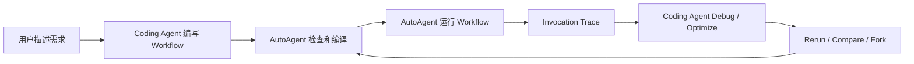
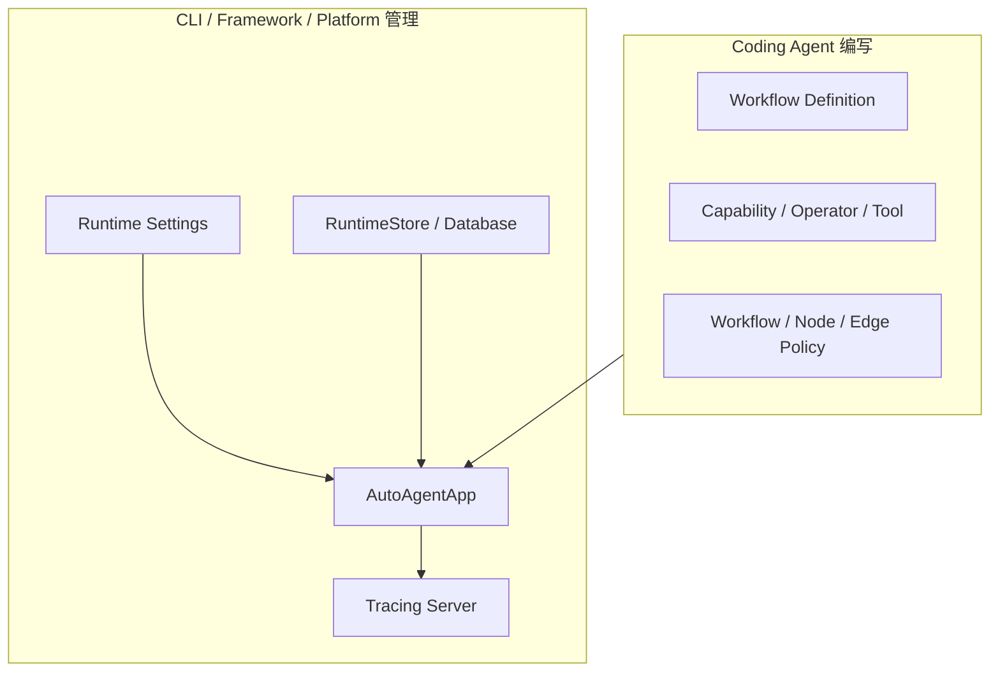
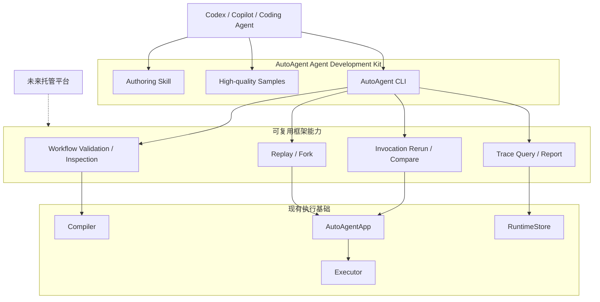

# AutoAgent MVP

## 1. 产品目标

AutoAgent 当前阶段不建设线上 Design 平台，也不在框架内部实现一个新的 Coding
Agent。用户可以在本地使用 Codex、GitHub Copilot 或其他 Coding Agent：

1. 根据需求编写 Workflow。
2. 使用 AutoAgent 提供的确定性工具检查、编译和运行 Workflow。
3. 根据真实 Invocation Trace 调试或优化 Workflow。
4. 重新运行或 Fork Invocation，验证修改是否有效。

AutoAgent 负责提供适合 Coding Agent 使用的 ADK、运行时和调试基础设施；Coding
Agent 负责理解用户需求、搜索项目代码并修改 Workflow。



## 2. 核心边界

### 2.1 Coding Agent 只编写 Workflow

Coding Agent 生成的业务代码只负责描述：

- Workflow、Node 和 Edge。
- Workflow 所需的 Capability、Operator 和 Tool。
- Input Mapping、Condition、Output Binding 和 Aggregator。
- Retry、Fallback、Timeout、Recovery、Map、Replication、Loop 和 Wait 等
  Workflow 语义。
- LLM、Tool、ReActWorkflow 和子 Workflow。

Coding Agent 不负责决定：

- 如何创建和启动 `AutoAgentApp`。
- 使用内存、SQLite、PostgreSQL 还是未来的远程 RuntimeStore。
- 数据库地址、持久化队列、并发数和 Retention 配置。
- Server 监听地址、运行模式和部署方式。
- 托管平台中的租户、权限、Secret 和资源配额。

这些属于运行环境，由 AutoAgent CLI、框架启动器、最终用户配置或未来托管平台负责。

### 2.2 Workflow 语义与部署配置分离



Workflow 文件不能因为部署环境不同而改变业务定义。数据库、并发、持久化和 Server
配置不能写进 Workflow 语义。

### 2.3 一套入口和一套生命周期

AutoAgent 不应同时提供多种等价的 Workflow 定义、注册、启动和 Invoke 方法。

目标约束：

- 一种标准 Workflow 导出方式。
- 一种 Capability/Operator 注册方式。
- 一种 Workflow 注册方式。
- 一种同步 Invoke 语义以及对应的异步形式。
- 一种 App 启动和关闭生命周期。
- CLI、嵌入式 Server 和未来平台复用相同底层路径。
- 不提供隐藏的默认 App。
- 不允许 `workflow.invoke()` 绕过 App。
- 不允许 CLI 为了方便重新实现一套 Compiler 或 Executor。

同步和异步 API 可以同时存在，但必须进入同一 App、Runtime 和 Executor，不是两套
行为。

### 2.4 只向 Coding Agent 暴露需要使用的 API

公开 API 以 Workflow authoring 为中心。Coding Agent 不应接触：

- Scheduler 和 Executor 内部对象。
- Mutable Invocation、Session 和 NodeExecution 聚合。
- PersistenceCoordinator、PersistenceEnvelope 和数据库 Row。
- StateOperations、Recovery checkpoint 实现和 Event reducer 内部细节。
- Workflow IR 的内部索引和编译缓存。
- Server 内部 Request/Response 适配器。

内部能力可以被 CLI、Server 和框架自身使用，但不进入 Authoring Skill 和用户
Sample。

## 3. 本地优先架构

Skill、CLI 和未来平台必须共享同一套底层能力，不能把业务逻辑写死在 CLI 或 UI。



第一阶段通过本地 CLI 使用这些能力。未来平台只增加 API、权限、远程执行和 UI，
不重写 Workflow 检查、Trace 整理、Rerun、Compare 或 Fork。

## 4. MVP1：Agent Authoring Kit

### 4.1 阶段目标

Coding Agent 不阅读 AutoAgent 内部实现，只依赖稳定公开 API、标准 Skill、高质量
Sample 和 CLI，就能生成、检查并运行正确的 Workflow。

### 4.2 稳定公开 API

公开 API 需要按用途划分，而不是把所有内部类型从 `__init__.py` 重新导出。

主要公开能力包括：

- Workflow、Node、Edge。
- Workflow authoring 使用的 Context。
- CapabilityRef、OperatorRef 和 SystemCommand。
- Workflow、Node 和 Edge Policy。
- `AutoAgentApp` 的稳定运行入口。
- Invocation 的只读公开结果。
- 结构化的 Workflow Diagnostic 和公开异常。
- AI、Tool 和 ReActWorkflow 的稳定扩展 API。
- 少量真正需要用户配置的进阶存储接口。

公开 API 的具体包结构在实现前单独确认。本 MVP 不预先要求使用带下划线的内部包名，
也不因为目录位置判断一个对象是否公开。公开契约由以下内容共同确定：

- 明确的公开模块。
- 精确的 `__all__`。
- Public API Contract Tests。
- Sample 和 Skill 只使用公开模块。
- 未进入公开契约的对象不保证兼容。

#### API 一致性要求

- Workflow 代码不创建 App。
- Workflow 代码不创建 RuntimeStore 或 DatabaseBackend。
- App 由 CLI、框架启动器或宿主应用创建。
- App 配置从环境、配置文件或宿主显式配置读取。
- 注册后的 Workflow 使用固定编译结果执行。
- 修改后的 Workflow 作为新的定义重新加载，不能原地修改活动运行。
- 用户和 Coding Agent 不能直接修改 Runtime 内部聚合。

#### 公开结果和异常

对外方法不应返回可以破坏 Runtime 状态的内部可变对象。需要提供只读公开结果，例如：

- Workflow 注册或检查结果。
- Invocation 结果和状态快照。
- Diagnostic。
- Runtime/持久化公开状态。

常见错误需要稳定错误类型和结构化字段，不能只返回难以解析的 `ValueError` 字符串。

### 4.3 标准 Authoring Skill

Skill 指导 Coding Agent：

1. 从用户需求提取 Workflow input/output、业务步骤、分支、并行、Loop、Wait 和
   外部副作用。
2. 将需求映射成 AutoAgent 的公开 Workflow API。
3. 只使用公开模块，不读取或导入框架内部实现。
4. 使用稳定 Node/Edge ID。
5. 正确区分 Input Mapping、Condition、Operator、Aggregator 和 Output Binding。
6. 正确选择 Retry、Fallback、Timeout 和 Recovery Policy。
7. 避免并行 Context 写冲突和无界 Map/Replication。
8. 使用 CLI 检查、修复、运行和验证 Workflow。

Skill 规定固定工作循环：

```text
理解需求
→ 编写 Workflow
→ workflow check
→ 修复 Diagnostic
→ workflow list
→ 确认项目导出的 Workflow
→ invocation run
→ 检查结果和 Trace
```

Skill 不能教 Coding Agent 使用内部 Runtime、Scheduler、Executor 或数据库对象。

### 4.4 高质量 Sample

MVP1 使用一个完整示例项目中的三个 Workflow：

1. Condition、分支、Loop、并行执行和汇总。
2. Wait/Resume 和跨进程恢复。
3. LLM、Tool、结构化输出和 ReActWorkflow。

三个 Workflow 共同覆盖主要 Authoring 能力，避免为了数量增加重复或低质量
Sample。示例目录是可运行参考，不是用户项目必须遵守的目录模板。

每个 Sample 包含：

- 用户需求。
- Workflow 设计说明。
- 完整代码。
- 预期 Graph。
- 测试输入和预期结果。
- CLI 检查与运行命令。
- 常见错误。
- 自动化测试。

Sample 默认不依赖随机行为或真实收费服务。需要外部服务时提供稳定 Mock。

### 4.5 Workflow CLI

CLI 负责创建 App、加载 Workflow、应用运行配置、调用 Compiler 和关闭资源。
Workflow 文件本身不负责这些工作。

#### 检查 Workflow

```bash
autoagent workflow check refund
```

Workflow ID 由项目根目录的 `auto-agent.toml` 声明。使用全局
`--project <directory-or-manifest>` 从其他目录选择项目。

输出：

- 是否有效。
- Workflow ID/version。
- Compiler Diagnostic。
- Entry/Exit。
- Node、Edge 和 Loop 数量。
- Warning。

CLI 使用稳定退出码区分：

- 检查通过。
- Workflow 编译失败。
- Workflow 模块加载失败。
- CLI 参数错误。
- Runtime 执行失败。

#### 运行 Workflow

```bash
autoagent invocation run refund \
  --input-file input.json \
  --event-mode full
```

CLI：

1. 按宿主配置创建 App。
2. 注册 Workflow 所需的 Capability/Operator。
3. 注册 Workflow。
4. 启动 App。
5. Invoke。
6. 输出 Invocation 公开结果。
7. 生成可选 Trace Report。
8. 关闭 App。

### 4.6 CLI Tracing 基础

将现在只便于 UI 使用的部分 Trace 计算下沉为可复用能力：

- Invocation 摘要。
- 实际 Graph 路径。
- NodeExecution 顺序和循环次数。
- Retry、Fallback、Timeout 和错误链。
- Wait/Resume。
- Node 和 Operator Timing。
- 指定 Event 查询。
- Full 模式指定 sequence 的 Runtime State 重建。

UI 保留 Graph、Timeline、Replay 动画和 Inspector 交互；MVP1 CLI 只提供一种
确定性的结构化 Text。`--report-file` 写入相同内容，但不会阻止 stdout 输出。
两者读取同一 Runtime 事实，不各自定义执行语义。

### 4.7 MVP1 验收

- Coding Agent 只阅读 Skill、Sample 和公开 API。
- Coding Agent 不导入框架内部模块。
- Coding Agent 可以根据三个代表性 Sample 组合主要 Workflow 能力。
- Compiler 错误可通过结构化 Diagnostic 修复。
- CLI 可以检查、列出和运行 Workflow，也可以恢复持久化 Wait。
- CLI 的 Text 输出和退出码稳定、确定。
- Workflow 代码不创建 App、Store、Database 或 Server。
- 相同 Workflow 在 CLI、本地宿主和未来 Server 中使用同一注册、编译和执行路径。

## 5. MVP2：Agent Debugging Kit

### 5.1 阶段目标

Coding Agent 可以读取适合机器理解的 Invocation 报告，搜索本地 Workflow 代码，
修改问题，并通过 Rerun、Compare 或 Fork 验证修改。

### 5.2 Agent-friendly Trace Report

Trace Report 不直接倾倒所有 Event，而是分层提供：

1. Invocation summary。
2. 实际执行路径和循环迭代。
3. 失败 Node/Edge/phase 和错误链。
4. Retry、Fallback、Timeout、Wait/Resume。
5. Node/Operator Timing 和资源等待。
6. 相关 input/output 和 Context 变化。
7. 按 NodeExecution、Event sequence 或 Runtime State 继续查询的命令。

报告提供 Markdown 和 JSON。默认控制数据量，大对象使用摘要或 ArtifactRef。

### 5.3 渐进式 Trace CLI

```bash
autoagent invocation report <invocation-id>
autoagent invocation node <invocation-id> --execution <execution-id>
autoagent invocation event <invocation-id> --sequence <sequence>
autoagent invocation state <invocation-id> --sequence <sequence>
```

报告提供 Workflow ID、Node ID、Edge ID、Hook/function 名称和 Operator ID。Coding
Agent 在本地项目中自行搜索源码；MVP2 不要求框架建立精确源码行索引。

### 5.4 Rerun 和 Compare

默认验证方式是使用修改后的 Workflow，从原 Invocation input 重新运行：

```bash
autoagent invocation rerun <invocation-id> \
  --workflow <workflow-locator>

autoagent invocation compare <old-id> <new-id>
```

Compare 至少包括：

- State、Result 和 Error。
- 实际路径。
- Node 执行次数。
- Retry/Fallback。
- 总耗时和 Node Timing。
- LLM Token。
- 最终 Context 差异。

### 5.5 Fork

Full Invocation 可以查询合法 Fork 点：

```bash
autoagent invocation fork-points <invocation-id>
```

Coding Agent 使用 Fork point ID，而不是猜测任意 Event sequence：

```bash
autoagent invocation fork <invocation-id> \
  --at <fork-point-id> \
  --workflow <workflow-locator>
```

Fork：

- 使用新的 Session 和 Invocation。
- 不修改原 Invocation。
- Fork 点之前只重建 Runtime State。
- Fork 点之后才真正执行 Executor。
- 检查修改后的 Workflow 是否与 Fork 点兼容。
- 不兼容时拒绝 Fork，并提示使用 Rerun。

### 5.6 MVP2 验收

- Coding Agent 可以从失败或慢 Invocation 获取简洁报告。
- Coding Agent 能根据 Workflow/Node/Hook/Operator 身份搜索代码。
- 修改后可以执行 Workflow Check。
- 可以使用原 input Rerun。
- 可以确定性比较新旧 Invocation。
- Full Invocation 可以列出合法 Fork 点。
- 兼容修改可以 Fork，不兼容修改得到明确诊断。

## 6. MVP3：Hosted Platform

MVP1 和 MVP2 稳定后，再讨论：

- Workflow 托管和远程运行。
- 多用户、项目、权限和 Secret。
- Workflow Revision 发布与回滚。
- 远程 RuntimeStore 和 Event Ingestion。
- 托管 Debug Runner。
- 生产 Invocation 采样和自动优化。
- AI Design/Debug UI。

平台复用 MVP1/MVP2 的 Skill、公开 API、Compiler Diagnostic、Trace Report、Rerun、
Compare 和 Fork，不重新定义这些能力。

## 7. 当前实施顺序

```text
MVP1.1  收口稳定公开 API 和唯一 Workflow 使用路径
MVP1.2  设计标准 Workflow 模块/目录契约
MVP1.3  改进 Compiler Diagnostic
MVP1.4  实现 Project Check、Workflow List/Check、Invocation Run/Resume 和 Serve CLI
MVP1.5  整理三个高质量 Sample
MVP1.6  编写 Authoring Skill
MVP1.7  完成 Agent Authoring 验收

MVP2.1  Agent-friendly Trace Report
MVP2.2  Node / Event / State 渐进查询
MVP2.3  Invocation Rerun
MVP2.4  Invocation Compare
MVP2.5  Fork Points 和 Fork
MVP2.6  完成 Agent Debugging 验收

MVP3    Hosted Platform，暂不实施
```

当前下一步是编写 Authoring Skill。历史 Invocation 的 Agent-friendly Report、
渐进式 Event 查询和 Fork 属于 MVP2。
