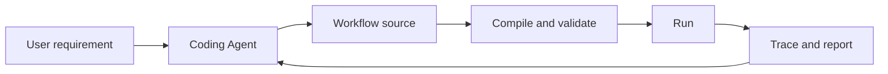
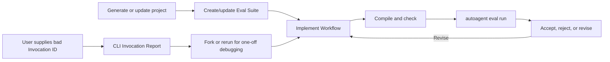

# AutoAgent MVP

This document defines AutoAgent's product stages and acceptance boundaries. It
changes only when the product direction changes. Current unfinished tasks and
implementation priority belong in [TODO.md](TODO.md).

## Product goal

AutoAgent is infrastructure for Coding Agents to create, validate, run, and
debug durable AI Workflows.

The Coding Agent owns business code:

- Workflow graph and typed data contracts;
- Conditions, mappings, bindings, aggregation, and policies;
- ordinary Python Operators, LLM calls, Tools, and reusable child Workflows.

AutoAgent owns framework behavior:

- project discovery and compilation;
- App lifecycle and execution;
- Runtime state, persistence, recovery, and Wait/Resume;
- Runtime Events, tracing, and debugging services;
- stable interfaces shared by the CLI, embedded Server, and future platform.

## Product principles

These constraints apply to every MVP:

1. Workflow business semantics remain separate from deployment configuration.
2. CLI, Server, embedded hosts, and future platform runners share one Compiler,
   App, Runtime, Scheduler, and Executor path.
3. Coding Agents use the stable public authoring API instead of internal
   Runtime objects.
4. Runtime state is authoritative in memory; persistence and remote services
   are replaceable infrastructure.
5. Debugging features derive from recorded Runtime facts rather than a second
   execution model.
6. Workflow revisions are immutable once registered. A code change creates a
   new definition and execution.

## MVP 1: Agent Authoring Foundation

### Goal

A Coding Agent can turn a business requirement into a valid, runnable AutoAgent
project without needing to understand framework internals.

### Deliverables

- A stable Workflow authoring API with explicit public exports.
- `auto-agent.toml` project discovery for one or more Workflow objects.
- Typed callable Operators and Hooks.
- Workflow graph features including branches, parallelism, fan-in, Loop, Map,
  Replication, Wait, and child Workflows.
- Execution policies for Retry, fallback, timeout, recovery, resources, and
  failure handling.
- LLM, Tool, structured output, and ReActWorkflow building blocks.
- Deterministic Compiler Diagnostics.
- CLI commands for project checks, Workflow checks, Invocation run/resume, and
  local Server startup.
- Three normative packaged examples:
  - conditional, parallel, Loop, and aggregation;
  - durable Wait/Resume;
  - LLM, Tool, and ReActWorkflow.
- A portable Authoring Skill for Coding Agents.

### Acceptance

MVP 1 is complete when independent Coding Agents can:

1. discover or install AutoAgent in a clean project;
2. understand a business-only requirement;
3. create a project and one or more Workflows using only public APIs;
4. compile and repair the project through stable Diagnostics;
5. run deterministic Invocation tests;
6. avoid App, persistence, Server, and internal Runtime code in Workflow
   modules.

## MVP 2: Local Agent Development Loop

The detailed design, data relationships, and implementation sequence live in
[MVP2.md](MVP2.md).

### Goal

A Coding Agent can complete a local, evidence-based debugging loop for a
failed, incorrect, or inefficient Agent: understand the execution, reproduce
the problem, modify the Workflow, evaluate the candidate Revision, detect
regressions, and reach a verifiable conclusion.

MVP 2 remains local. The Coding Agent edits the user's existing source tree and
uses the project's ordinary version control. AutoAgent supplies execution
evidence and evaluation infrastructure; it does not create cloud workspaces,
merge code, deploy a Candidate, or mutate an active Workflow Revision.

### Deliverables

- Project-owned Eval Suites, registered in `auto-agent.toml`, that replace
  standalone example input/expected pairs with executable business Cases. The
  initial Case contract checks final Invocation state and final business output.
- One `autoagent eval` CLI surface for validating, listing, and running Suites.
  Eval execution is owned by AutoAgent rather than exposed as a pytest command.
- An Eval Runner that returns one Eval Result for one Workflow Revision,
  including per-case results, Invocation IDs, errors, latency, Token/cost data,
  and aggregate outcomes.
- Authoring guidance requiring a Coding Agent to generate and pass a relevant
  Eval Suite before proposing a new Workflow Revision.
- A bounded, deterministic Agent-friendly Invocation Report containing final
  state/result/error, actual graph path, Loop executions, Retry/Fallback,
  timeout, Wait/Resume, failure chain, timing, resource use, persistence status,
  and stable execution identities without dumping the Event journal.
- Progressive local queries for one Invocation, NodeExecution, Edge evaluation,
  Operator Call, Event, and reconstructed Full-mode Runtime state.
- CLI contracts that let a Coding Agent report and inspect an Invocation,
  and validate/run an Eval Suite without importing framework internals.
- A separate debugging Skill that teaches the evidence-first repair loop rather
  than expanding the Workflow Authoring Skill into a general maintenance guide.
- Optional capture of an Invocation as a provisional Eval Case after the manual
  Report -> edit -> Eval loop is stable. Correct behavior must still be supplied
  before the Case can become a regression requirement.
- Full-mode Replay/Fork as a later MVP 2 enhancement for expensive or
  wait-heavy prefixes, after Report and Eval are stable. Fork must use
  legal execution boundaries, validate the new Workflow Revision against the
  reconstructed state, and create a new Session and Invocation without changing
  the original trace.

### Local debugging loop

Eval definitions belong to the project and may be versioned with its source.
Eval Results are command results: they are printed to stdout and may optionally
be copied to a normal file with `--report-file`. They are never written to the
Runtime database and AutoAgent does not maintain Eval history. Deterministic
assertions are the first implementation priority; probabilistic scoring and
LLM-as-a-judge are optional evaluators, not the foundation of the execution
model.

Report explains an observed execution, Fork or rerun supports immediate
debugging and verification, and Eval preserves regression-worthy business
behavior. A one-off defect does not have to become an Eval Case. Workflow
projects use Eval for end-to-end business behavior and keep ordinary tests only
for isolated user code; do not duplicate the same scenario in both.

The framework does not need a source-line database. Stable Workflow, Node,
Edge, Hook, and Operator identities are enough for a local Coding Agent to find
the relevant code.

### Acceptance

MVP 2 is complete when a Coding Agent can:

1. obtain a bounded report instead of reading an entire Event journal;
2. identify the failing, incorrect, or expensive execution boundary and query
   additional detail only when needed;
3. add or update a business Eval Case when the existing Suite does not describe
   the reported requirement;
4. modify and recompile the Workflow as a new immutable Revision;
5. pass the registered Eval Suite before proposing the code change;
6. run the complete registered Suite and detect unrelated business
   regressions;
7. report a reproducible accept/reject conclusion without changing or
   deploying the original Revision;
8. for the advanced path, Fork a compatible Full-mode Invocation from a legal
   boundary without modifying its original Session or trace.

### Boundary

MVP 2 does not include hosted runners, multi-tenancy, online source editing,
automatic merge or deployment, production traffic management, automatic
promotion, or Marketplace behavior. The Tracing UI may expose stable Report
and Fork contracts later, but CLI and Coding Agent workflows define
the MVP before UI integration.

## MVP 3: Hosted Workflow Platform

### Goal

Run and manage AutoAgent projects remotely without changing their Workflow
authoring or execution semantics.

### Deliverables

- project and Workflow revision registration;
- isolated runner processes;
- remote persistence ingestion, Artifact storage, and trace queries;
- publishing, rollback, configuration, and Secret management;
- tenancy, authentication, authorization, quotas, and observability;
- runner leases, fencing tokens, and idempotent takeover;
- hosted debugging runners using the MVP 2 report, rerun, Eval, and Fork
  contracts;
- optional AI-assisted design and optimization built on reviewable code
  changes.

### Acceptance

MVP 3 is complete when the same project can run locally or on the platform with
the same public Workflow contract, while the platform safely manages revisions,
execution ownership, persistence, and access.

## Outside the current MVP boundary

The following ideas must not complicate the current local execution model before
their owning stage is implemented:

- a platform-only Workflow language;
- hidden online mutation of active Workflow definitions;
- distributed multi-runner ownership without leases and fencing;
- automatic promotion of AI-generated patches without evaluation;
- one hard-coded Agent UI message model for every Workflow.
