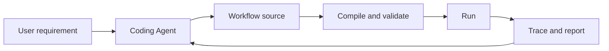

# AutoAgent MVP

This document defines AutoAgent's product stages and acceptance boundaries. It
changes only when the product direction changes. Current unfinished tasks and
implementation priority belong in [TODO.md](TODO.md).

## Product goal

AutoAgent is infrastructure for Coding Agents to create, validate, run, and
debug durable AI Workflows.

The Coding Agent owns business code:

- Workflow graph and typed data contracts;
- Conditions, mappings, bindings, aggregation, and policies;
- ordinary Python Operators, LLM calls, Tools, and reusable child Workflows.

AutoAgent owns framework behavior:

- project discovery and compilation;
- App lifecycle and execution;
- Runtime state, persistence, recovery, and Wait/Resume;
- Runtime Events, tracing, and debugging services;
- stable interfaces shared by the CLI, embedded Server, and future platform.

## Product principles

These constraints apply to every MVP:

1. Workflow business semantics remain separate from deployment configuration.
2. CLI, Server, embedded hosts, and future platform runners share one Compiler,
   App, Runtime, Scheduler, and Executor path.
3. Coding Agents use the stable public authoring API instead of internal
   Runtime objects.
4. Runtime state is authoritative in memory; persistence and remote services
   are replaceable infrastructure.
5. Debugging features derive from recorded Runtime facts rather than a second
   execution model.
6. Workflow revisions are immutable once registered. A code change creates a
   new definition and execution.

## MVP 1: Agent Authoring Foundation

### Goal

A Coding Agent can turn a business requirement into a valid, runnable AutoAgent
project without needing to understand framework internals.

### Deliverables

- A stable Workflow authoring API with explicit public exports.
- `auto-agent.toml` project discovery for one or more Workflow objects.
- Typed callable Operators and Hooks.
- Workflow graph features including branches, parallelism, fan-in, Loop, Map,
  Replication, Wait, and child Workflows.
- Execution policies for Retry, fallback, timeout, recovery, resources, and
  failure handling.
- LLM, Tool, structured output, and ReActWorkflow building blocks.
- Deterministic Compiler Diagnostics.
- CLI commands for project checks, Workflow checks, Invocation run/resume, and
  local Server startup.
- Three normative packaged examples:
  - conditional, parallel, Loop, and aggregation;
  - durable Wait/Resume;
  - LLM, Tool, and ReActWorkflow.
- A portable Authoring Skill for Coding Agents.

### Acceptance

MVP 1 is complete when independent Coding Agents can:

1. discover or install AutoAgent in a clean project;
2. understand a business-only requirement;
3. create a project and one or more Workflows using only public APIs;
4. compile and repair the project through stable Diagnostics;
5. run deterministic Invocation tests;
6. avoid App, persistence, Server, and internal Runtime code in Workflow
   modules.

## MVP 2: Agent Debugging Kit

### Goal

A Coding Agent can understand a failed, incorrect, or slow Invocation, modify
the Workflow, and verify whether the change improved behavior.

### Deliverables

- A compact Agent-friendly Invocation report containing:
  - final state, result, and error;
  - actual graph path and Loop executions;
  - Retry, fallback, timeout, Wait/Resume, and failure chain;
  - timing and relevant execution identities.
- Progressive queries for a NodeExecution, Event, and reconstructed Full-mode
  Runtime state.
- Invocation rerun from the original input with a newly loaded Workflow.
- Deterministic comparison of old and new Invocations.
- Legal Full-mode Fork points.
- Workflow compatibility validation at a Fork point.
- Backend Fork execution that creates a new Session and Invocation without
  changing the original execution.
- Tracing UI support for reports, comparison, and Fork after backend contracts
  stabilize.

The framework does not need a source-line database. Stable Workflow, Node,
Edge, Hook, and Operator identities are enough for a local Coding Agent to find
the relevant code.

### Acceptance

MVP 2 is complete when a Coding Agent can:

1. obtain a bounded report instead of reading an entire Event journal;
2. identify the failing or expensive execution boundary;
3. query additional detail only when needed;
4. modify and recompile the Workflow;
5. rerun and compare behavior;
6. Fork a compatible Full-mode Invocation from a legal boundary.

## MVP 3: Hosted Workflow Platform

### Goal

Run and manage AutoAgent projects remotely without changing their Workflow
authoring or execution semantics.

### Deliverables

- project and Workflow revision registration;
- isolated runner processes;
- remote persistence ingestion, Artifact storage, and trace queries;
- publishing, rollback, configuration, and Secret management;
- tenancy, authentication, authorization, quotas, and observability;
- runner leases, fencing tokens, and idempotent takeover;
- hosted debugging runners using the MVP 2 report, rerun, compare, and Fork
  contracts;
- optional AI-assisted design and optimization built on reviewable code
  changes.

### Acceptance

MVP 3 is complete when the same project can run locally or on the platform with
the same public Workflow contract, while the platform safely manages revisions,
execution ownership, persistence, and access.

## Outside the current MVP boundary

The following ideas must not complicate the current local execution model before
their owning stage is implemented:

- a platform-only Workflow language;
- hidden online mutation of active Workflow definitions;
- distributed multi-runner ownership without leases and fencing;
- automatic promotion of AI-generated patches without evaluation;
- one hard-coded Agent UI message model for every Workflow.
