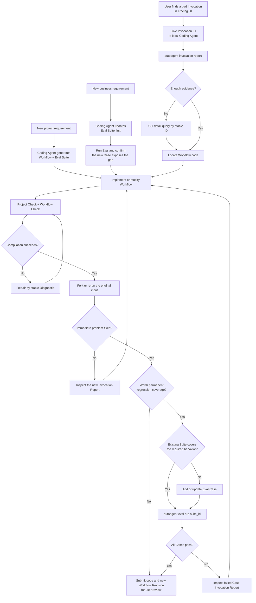
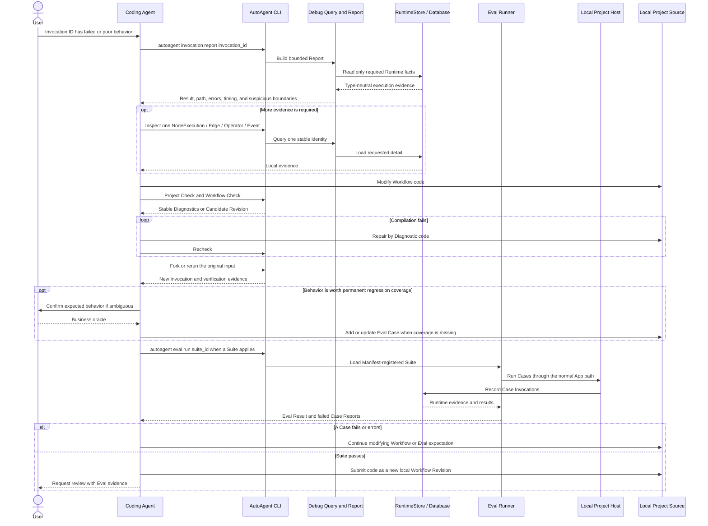
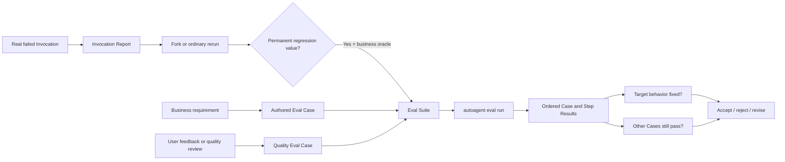
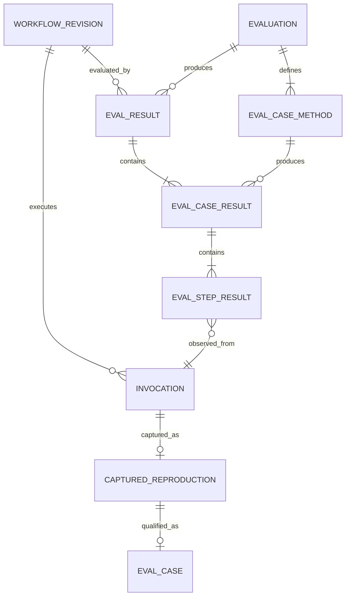

# MVP 2: Local Agent Development Loop

This document is the working design and implementation plan for AutoAgent MVP
2. The stable stage goal and acceptance boundary remain in [MVP.md](MVP.md).
Current implementation priority remains in [TODO.md](TODO.md).

## Product outcome

MVP 2 gives a local Coding Agent an evidence-based loop for debugging and
improving an Agent or ordinary Workflow:

```text
detect a problem
-> understand the execution
-> debug with Fork or an ordinary rerun
-> modify the Workflow
-> verify the immediate fix
-> preserve regression-worthy behavior as an Eval Case
-> detect regressions
-> reach a verifiable conclusion
```

The Coding Agent edits the existing project and uses its ordinary version
control. AutoAgent provides read-only execution evidence and evaluation. It
does not edit source, merge code, deploy a Candidate, or mutate an immutable
Workflow Revision.

## Product workflows



The Tracing UI is where a user discovers and selects an Invocation. All Coding
Agent evaluation and debugging operations use the local AutoAgent CLI. An
explicit Runtime failure does not require an existing Eval Case; the Coding
Agent first reads its Report and may use Fork or an ordinary rerun to explore
and verify a fix. It adds a Case only when the behavior is worth preserving as
a repeatable business regression requirement and the Suite does not already
express that requirement.

## Report, Fork, rerun, and Eval responsibilities

These mechanisms are complementary rather than mandatory stages of one fixed
pipeline:

- an Invocation Report explains what happened in one observed execution;
- Fork preserves a compatible historical Runtime boundary for fast debugging;
- an ordinary rerun checks the original input against the current project
  Workflow Revision in a new Session; when recorded evidence permits, it also
  copies the source Invocation's pre-admission Session Context into that new
  Session;
- an Eval Case stores an explicit business expectation for repeatable
  regression checking;
- an Eval Suite checks that one repair did not break other protected business
  scenarios.

A one-off repair may finish after Report plus Fork or rerun verification. Do
not require every bad Invocation to become an Eval Case. Promote a scenario
when it represents a durable business rule, a likely regression, a model or
Tool behavior that must be monitored, or a defect that must not recur.

## Coding Agent interaction sequence



## Evaluation lifecycle



An Eval Suite is the Manifest locator for one Python ``Evaluation`` class and
one Workflow, similar to a test module:

```text
[[eval_suites]] Manifest entry
= suite id + Workflow id + Evaluation entrypoint

Evaluation class
= ordered async eval_* methods

eval_* method
= one isolated Case Session + its Invoke/Resume Steps
```

AutoAgent owns Workflow execution, Runtime assertions, Revision identity, and
result rendering. Semantic LLM quality systems such as DeepEval may be optional
Evaluator adapters; they do not replace the AutoAgent Runtime or Eval Runner.

## Core data relationships



### Workflow Revision

An immutable compiled Workflow definition. A source change produces another
Revision.

### Captured Reproduction

An optional later convenience for preserving evidence needed to reproduce an
observed problem. Fork and ordinary rerun are sufficient for the initial debug
loop. A reproduction does not define the correct result and is not
automatically a qualified Eval Case.

### Eval Case

One asynchronous ``eval_*`` method. The Runner supplies an ``EvalCase``
controller. Each call to ``case.invoke`` or ``case.resume`` is one internal
Step, and all Steps share one isolated Session. A Step may have no Evaluators
when it exists only to build Session state.

### Eval Suite

A lightweight Manifest locator containing a stable suite id, one Workflow id,
and one ``module:EvaluationClass`` entrypoint. It is not a separate Python data
model and it does not own App configuration.

### Eval Result

The in-process result of running one Manifest Suite against one Workflow
Revision. It contains only ordered Case Results; Case Results contain ordered
Step Results; Step Results contain Evaluator Results and references to Runtime
evidence. Counts and aggregate status are derived rather than duplicated. The
CLI prints this result and can tee it to an ordinary file; it is not a Runtime
database record and AutoAgent does not maintain Eval history.

## Major modules

### 1. Debug query and Invocation Report

Responsibilities:

- read current in-memory or historical database-backed execution facts;
- remain type-neutral when the active App has not registered historical Runtime
  models;
- report recorded facts and deterministic conditions such as Retry, timeout,
  persistence gaps, and truncation, without inferring a root cause or proposing
  a code change;
- produce compact reports for active, waiting, terminal, and partially durable
  Invocations;
- use stable cursor pagination for every potentially growing execution
  collection instead of embedding a truncated Event, NodeExecution, Edge, or
  Operator Call list in the root Report;
- make the root Report a diagnostic summary and progressive-query index rather
  than a shortened Trace dump;
- include one deterministic primary boundary when available, such as the
  failing NodeExecution, active Wait, or currently running NodeExecution, and
  expose additional matching boundaries only through counts and paged queries;
- resolve evidence from a discoverable running Server or an explicitly
  configured durable database; a separate CLI process cannot query an expired
  memory-only RuntimeStore;
- prefer a matching running Server because it owns the latest in-memory state,
  and use the database only when no matching Server is available or the user
  explicitly selects it;
- expose direct lookup and pagination by stable identity;
- report missing detail and journal gaps instead of inventing state.

For local source discovery, the configured or default local Server address is
only a candidate. It is selected only when its authenticated Report endpoint
can resolve the requested Invocation and that Invocation's Workflow is declared
by the current project. A missing, unreachable, or unrelated candidate falls
back to `AUTOAGENT_DATABASE_URL` in automatic mode. The database path must be
explicit and already exist; a read-only Report command never creates a new
SQLite file. `--source server` and `--source database` make either choice
strict. When neither source is authoritative, the CLI returns an actionable
diagnostic rather than starting an App or recovering Runtime state.

The first report contract should include:

- Workflow Revision, Session, Invocation, Event mode, and observed sequence;
- current/final state, input/output summary, and structured error;
- chronological Node and Edge path with Loop occurrence;
- Operator attempts, Retry/Fallback/timeout, and Tool/LLM summaries;
- Wait/Resume and Recovery boundaries;
- critical path, phase timing, Token, cost, and call counts when recorded;
- persistence durability and incomplete-evidence warnings.

The accepted V1 read model lives in `autoagent.debug`, shared by CLI, Server,
and future platform adapters, but is not re-exported from the root Workflow
authoring API. `InvocationReport` is the only top-level result. It contains
source, Invocation and Workflow identity, lifecycle timestamps, observed/live/
durable sequences, persistence status, bounded Input and Result summaries, a
bounded structured error, one deterministic primary investigation boundary,
flat execution counts, categorized UserEvent counts, available-evidence names,
and evidence warnings. Supporting models are limited to `ValueSummary`,
`ReportError`, `PrimaryBoundary`, and `EvidenceWarning`; there is no separate
Report Run, Result, or Section hierarchy.

The primary boundary is the most precise recorded subject associated with the
terminal error, active Wait, or active NodeExecution. It is a fact reference,
not a root-cause conclusion. Completed Invocations without such a condition do
not invent one. Aggregate counts must come from current Runtime aggregates,
type-neutral recovery snapshots plus a bounded tail, or database aggregation;
root Report generation must not scan an entire large Event journal.

Values must be token-conscious. Small scalar values may be shown inline after
redaction; larger strings, objects, collections, Context branches, inputs, and
outputs expose only type, shape, stable digest, serialized size, and ArtifactRef
when available. Full or path-selected values require an explicit progressive
detail query.

Detail queries must address one Invocation, NodeExecution, Edge evaluation,
Operator Call, Event, or Full-mode state boundary without first loading the
complete journal. List queries use stable cursors and preserve the Report's
observed sequence boundary so an active Invocation cannot silently change the
meaning of later pages.

The first implemented progressive pages are RuntimeEvents and UserEvents.
Their opaque cursors bind the Invocation, query kind, filters, and observed
sequence and reject modification or reuse with another query. List items carry
only bounded metadata; one explicit detail lookup returns bounded summaries of
payload, input, output, or data. NodeExecution, Edge, Operator Call, and
historical state pages build on the same cursor contract.

`autoagent invocation report <invocation-id>` has one nonterminal behavior,
not separate immediate and terminal-wait command variants. A `waiting`
Invocation is already a stable debugging boundary and returns immediately. If
the Invocation is `created` or `running`, the command waits through Server
notifications for at most 10 seconds for `waiting` or a terminal state. When it
is still running, the command returns the current observed Report with
`INVOCATION_STILL_RUNNING`; it does not fail or wait indefinitely.

The root Report includes only UserEvent counts grouped into semantic message,
reasoning, Tool call, Tool result, Agent output, custom, and stream-delta
categories. It does not inline UserEvent data. The default paged UserEvent query
returns completed semantic events and custom events; `message_delta`,
`reasoning_delta`, and `tool_call_delta` require an explicit stream-diagnostic
query because they are UI transport evidence rather than normal Coding Agent
debugging context.

Invocation Reports and Invocation comparisons are derived, on-demand results
like Eval Results. They are never written to the Runtime database and AutoAgent
does not maintain Report history. The CLI always renders the compact result to
stdout; `--report-file` may tee the same content to an ordinary file without
suppressing terminal output. Any in-process cache is disposable, sequence-bound,
and never authoritative.

### 2. Evaluation definition

The initial model supports:

- one ``Evaluation`` class per Manifest Suite;
- one async ``eval_*`` method per stable Case id;
- an ``EvalCase`` controller with ``invoke`` and ``resume`` methods;
- a new isolated Session per Case and multiple Invocations in that Session;
- optional Evaluators on every Step;
- strict built-in Invocation-state and complete Invocation-result Evaluators;
- a public Evaluator protocol for business-specific checks.

Authors do not construct an explicit Suite, Case, or Step data model. They use
ordinary Python control flow inside the Case method. A ``passed=False`` result
stops the current Case; a score-only result uses ``passed=None`` and does not
stop it.

```python
from autoagent.evaluation import EvalCase, Evaluation, evaluators


class InventoryEvaluation(Evaluation):
    async def eval_out_of_stock(self, case: EvalCase) -> None:
        await case.invoke(
            {"sku": "A-001", "quantity": 100},
            evaluators=(
                evaluators.InvocationState(expected="completed"),
                evaluators.InvocationResult(
                    expected={
                        "output": {
                            "accepted": False,
                            "reason": "out_of_stock",
                        }
                    }
                ),
            ),
        )
```

```toml
[[eval_suites]]
id = "inventory_regression"
workflow_id = "inventory"
entrypoint = "evals.inventory:InventoryEvaluation"
```

```bash
autoagent eval list
autoagent eval check inventory_regression
autoagent eval run inventory_regression
autoagent eval run inventory_regression --case eval_out_of_stock
```

Graph-path, call-count, Retry, Loop, Wait, latency, Token, cost, and scoring
expectations are recorded extensions, not initial requirements.

The project owns Eval definitions. Store them by convention under `evals/` and
register every Suite explicitly in `auto-agent.toml`; do not silently scan
arbitrary Python files. The Manifest entrypoint remains the discovery contract,
so a project may use another importable layout when necessary.

`autoagent eval` is the only public execution surface for project Eval Suites.
AutoAgent owns Case execution and result rendering; do not expose Eval
execution as a pytest command or require users to duplicate Cases as pytest
functions. The AutoAgent repository may still use ordinary unit tests to verify
the Eval framework itself.

Workflow projects use Eval Cases for end-to-end business behavior. Ordinary
tests remain optional and cover isolated user code such as complex Conditions,
Mappings, Tools, Operators, or custom Evaluators. Do not duplicate the same
business scenario in both a unit test and an Eval Case.

### Evaluation data and dependency realism

"Real" has two independent dimensions: input data and execution dependencies.
Eval always runs the real Workflow through the normal AutoAgent execution path,
but it does not have to send unredacted production data to production services.

- use redacted production-derived inputs to cover real distributions and past
  incidents;
- use synthetic inputs to cover boundaries not represented in production;
- use the real model when model quality, Tool selection, structured output, or
  ReAct behavior is under evaluation;
- use sandbox or staging services for integration behavior and side effects;
- use controlled simulations or recorded responses when an external dependency
  is not the subject of the Eval, is destructive, costly, or unstable.

Eval results must identify material simulated dependencies. A controlled
regression run and a live-quality run may use the same Case model with different
host environments; do not create two incompatible Eval data models.

### 3. Evaluators

Implement only the initial deterministic Evaluators first:

- ``evaluators.InvocationState(expected=...)``;
- ``evaluators.InvocationResult(expected=...)`` using exact comparison;
- the public ``Evaluator.evaluate(EvaluationContext)`` protocol.

``EvaluatorResult.passed`` is ``True`` for a gating pass, ``False`` for a
business mismatch, and ``None`` for observational or score-only output.
Evaluator infrastructure failure is recorded separately from a failed business
expectation. The imperative Case API does not invent ``skipped`` results for
Step calls that never happened.

Add semantic or LLM-as-a-judge adapters, including possible DeepEval
integration, only after the deterministic result contract is stable. AutoAgent
owns Workflow execution, Revision identity, Invocation evidence, and result
assembly; external frameworks may provide output Evaluators instead of
replacing the Eval Runner.

### 4. Eval Runner

Responsibilities:

- compile and pin one immutable Workflow Revision for a Run;
- execute Cases through the same `AutoAgentApp` and Executor path as normal
  Invocations;
- isolate Sessions between Cases unless a Case explicitly defines a sequence;
- continue the Suite after an individual Case failure;
- bound Case and Suite concurrency through existing App limits;
- produce deterministic result ordering even when Cases execute concurrently;
- associate every Step Result with its Invocation id and observed sequence;
- keep Runtime journal data authoritative instead of copying trace, state,
  output, and timing into Eval Results;
- never treat missing Provider credentials or broken test infrastructure as a
  business assertion failure.

Eval definitions may be committed with project source. Each run prints its
structured result before closing the Host. `--report-file` may copy the same
output to a normal file for handoff, but no Eval Result is persisted to the
Runtime database or retained behind a history-query API. Runtime evidence
remains available afterward only when the normal Runtime database is configured.

### 5. Optional Reproduction capture and qualification

This is a later convenience after the manual Report -> edit -> Eval loop is
stable. Capture should collect only the evidence needed to reproduce behavior:

- Invocation input and Workflow Revision;
- required Session history or Context;
- Resume steps;
- relevant Provider and Tool responses when recorded;
- observed error and trace identities;
- provenance back to the source Invocation.

Capture cannot infer every business oracle. A new artifact starts as
`needs_expectation` until a Coding Agent or user defines correct behavior.

Ordinary rerun does not print the source Input for a Coding Agent to copy. It
resolves the complete value internally by Invocation id, preserves the source
Invocation, and invokes the current project Workflow Revision in a new Session.
When the pre-admission Session Context is available, rerun copies that Context
so stateful and multi-turn behavior is reproducible without continuing the
original Session. If that evidence is unavailable, rerun may use only the
original Input but must emit `SESSION_CONTEXT_NOT_REPRODUCED` and must not claim
strict equivalence. A comparison can describe state, output, path, timing, and
error differences between source and new Invocations, but only an Eval
expectation can decide whether the new business result is correct.

Rerun is restricted to the environment that owns the source evidence. A
Server-sourced Invocation is rerun by that same Server, and a database-sourced
Invocation is rerun by a ProjectHost configured for that same database and
project environment. V1 does not transfer raw Input or Session Context from a
Server into a different local execution environment. Comparison likewise
requires both Invocations to be visible through the same evidence source.

Provide pluggable redaction with safe defaults. Never copy Secrets, credentials,
an entire production database, or unbounded user content. When Standard or
Minimal mode lacks required evidence, report that limitation and request a
fixture rather than fabricating one.

### 6. Coding Agent CLI and Skill

CLI capability groups, with final command names still to be designed:

- build and inspect an Invocation Report;
- query one execution boundary;
- validate and run an Eval Suite;
- optionally capture an Invocation as a provisional Case later.

Commands must return deterministic, bounded information and preserve normal
terminal output when also writing an optional report file.

After the Eval CLI stabilizes, update the Authoring Skill to require generation
and successful execution of an appropriate Eval Suite before handing off a new
Workflow. Add a separate debugging Skill that teaches:

1. read the bounded Report;
2. query only the suspicious boundary;
3. classify the owning layer;
4. check whether the existing Suite expresses the reported requirement;
5. add or update a Case when coverage is missing;
6. modify and compile the Workflow;
7. run the registered Suite through `autoagent eval`;
8. report the passing and failing Case evidence from the current run.

Do not expand the Authoring Skill into framework debugging or require large
project-specific test matrices.

### 7. Advanced Full-mode Replay and Fork

Implement only after Eval Runner and Report are stable. Full-mode
Fork is useful when the prefix is expensive, slow, or contains Wait steps; it
is not required for ordinary regression testing.

Requirements:

- define legal boundaries using existing Runtime Events;
- reconstruct Runtime and Context without re-executing Operators before the
  boundary;
- validate Candidate Workflow compatibility at the selected boundary;
- create a new Session and Invocation;
- preserve the original Invocation and trace;
- evaluate a regression-worthy Fork outcome through the normal Eval model.

Minimal mode cannot Fork. Standard mode lacks internal state operations needed
for arbitrary phase reconstruction. Ordinary Rerun from original input remains
available for all modes.

## Implementation plan

### Phase 0: Freeze contracts and decisions

Deliverables:

- audit current Runtime Event, UserEvent, trace query, recovery-state, CLI, and
  ProjectHost capabilities against this design;
- choose package ownership for public debugging and evaluation APIs;
- define the first version of Evaluation, EvalCase, internal Step, Runner, and
  Evaluator/Step/Case/Eval Result hierarchy;
- record Report, Fork, rerun, and Eval ownership, with automatic capture,
  scoring, and aggregate policies kept as later extensions;
- extend the Manifest contract with explicit Eval Suite entrypoints and define
  the conventional `evals/` project layout;
- define size limits, pagination, redaction, and incomplete-evidence behavior;
- define which fields are available in Minimal, Standard, and Full modes.

Acceptance:

- model examples cover ordinary Invoke and Wait/Resume scenarios;
- no model requires Server, UI, cloud, or Git management;
- no duplicate Runtime execution model is introduced.

### Phase 1: Eval framework and CLI

Implementation steps:

1. Implement ``Evaluation``, ``EvalCase``, the Evaluator protocol, and the
   minimal Evaluator/Step/Case/Eval Result hierarchy.
2. Extend `auto-agent.toml` with explicit `[[eval_suites]]` entrypoints and
   stable loading diagnostics.
3. Implement deterministic final-state and exact-output evaluation plus the
   narrow custom output Evaluator contract.
4. Pin and compile one Workflow Revision per Run and execute every Case through
   ProjectHost and AutoAgentApp.
5. Isolate Sessions by default and support explicit multi-turn and Wait/Resume
   steps.
6. Add `autoagent eval list`, `check`, and `run` commands with deterministic
   human-readable output and optional report files.
7. Add bounded concurrency, cancellation, timeout, interrupted-run, and large
   Suite performance coverage.

Acceptance:

- a Coding Agent can generate one Manifest-registered Suite and run it entirely
  through `autoagent eval`;
- Cases cover ordinary Workflow, ReAct, and Wait/Resume behavior;
- one broken Case does not hide sibling results;
- infrastructure or Evaluator errors cannot be mistaken for failed business
  expectations;
- no pytest command or duplicate test definition is required.

### Phase 2: Authoring integration

Implementation steps:

1. Replace standalone `inputs/` and `expected/` authoring examples with Eval
   Cases and reusable fixture files where appropriate.
2. Update the Authoring Skill so every generated project defines relevant Eval
   Cases and passes its registered Suite before handoff.
3. Add one end-to-end Skill evaluation proving requirement -> Workflow + Suite
   -> compile -> `autoagent eval run`.
4. Keep ordinary unit tests only for project-owned deterministic helper logic
   that is better tested outside a complete Invocation.

Acceptance:

- a new Coding Agent project is not considered complete until its Suite passes;
- business inputs and expected outcomes have one authoritative Eval definition;
- the Skill does not spend tokens duplicating the same behavior as both unit
  tests and Eval Cases.

### Phase 3: Invocation Report and progressive queries

Implementation steps:

1. Add type-neutral read models and a read-only Debug Query service.
2. Build ordered execution summaries from current Runtime facts.
3. Add bounded value summaries and structured evidence warnings.
4. Expose `autoagent invocation report` and direct detail queries through the
   local CLI.
5. Add fixture-based tests for Minimal, Standard, Full, active, waiting,
   completed, failed, persistence-gap, Loop, Retry/Fallback, Map, and ReAct
   Invocations.
6. Benchmark report generation with large journals and outputs.

Acceptance:

- a user can copy an Invocation ID from Tracing UI and give it to a local Coding
  Agent;
- the Coding Agent can locate a failing or expensive boundary using only CLI
  commands and without loading the complete Event journal;
- all missing or non-durable evidence is explicit.

### Phase 4: Local debugging Skill

Implementation steps:

1. Add a separate Skill for the Invocation-ID debugging workflow.
2. Teach Report-first progressive queries and owning-layer classification.
3. Teach the Agent to add or update an Eval Case only when the Suite does not
   already express the reported business requirement.
4. Require compile -> `autoagent eval run` -> evidence-based handoff before
   proposing the new Workflow Revision.
5. Forward-test failed, incorrect, and slow Invocations without exposing
   AutoAgent internals.

Acceptance:

- an independent Coding Agent can complete Invocation ID -> Report -> code
  change -> Eval Result -> user-review handoff entirely through CLI;
- infrastructure and framework failures are not disguised as Workflow fixes.

### Phase 5: Optional Invocation-to-Case capture

After the manual debugging loop is stable, optionally capture a provisional
Case from an Invocation with provenance, redaction, size limits, Session/Resume
state, and available external fixtures. The Coding Agent or user must still
define correct behavior before installing it into a Suite.

### Phase 6: Optional Full-mode Replay/Fork

Implement legal Full-mode Fork and compatibility validation only after the
ordinary CLI debugging loop passes independent evaluations. MVP 2 does not add
Report, Eval, or code-editing actions to Tracing UI; the existing UI remains the
place where a user discovers an Invocation and copies its identity.

## Testing strategy

Use the existing incident, Wait/Resume, and ReAct fixtures as framework-level
integration inputs, then add one packaged local debugging example only after
the public contracts stabilize.

Test layers:

- model and diagnostic unit tests;
- Report projection tests over recorded Runtime facts;
- Evaluator truth tables;
- Eval Runner integration against real AutoAgentApp execution;
- persistence restart tests for historical reports and Wait/Resume Cases;
- CLI end-to-end tests in temporary projects;
- report-size, large-journal, and Suite-concurrency benchmarks;
- independent Coding Agent Skill evaluations.

Do not duplicate the framework's complete execution-policy test suite inside
MVP 2. Each new test should prove an MVP 2 contract or integration boundary.

## Explicit non-goals

MVP 2 does not include:

- hosted runners or remote project workspaces;
- multi-tenancy, authentication, billing, quotas, or cloud Secrets;
- online source editing, automatic merge, or automatic deployment;
- production traffic sampling, anomaly detection, or automatic optimization;
- Canary release or automatic promotion;
- a source-line database;
- arbitrary Fork from Minimal or Standard Event modes;
- a mandatory Chat UI or one fixed Agent message model;
- reimplementation of general-purpose LLM quality metric libraries.

## Remaining design decisions

1. What exact `[[eval_suites]]` Manifest fields and `module:object` validation
   rules are required beyond the Suite entrypoint?
2. Which debugging and evaluation models are stable public Python APIs versus
   CLI-only schemas?
3. Which value previews and Context paths are safe by default, and how are
   project-specific redactors registered?
4. Which cost model is authoritative when a Provider reports Token usage but
   price is configured externally?
5. Which deterministic Evaluator subset is required before adding a DeepEval or
   other semantic-quality adapter?
6. Which current Runtime Events are insufficient for a complete Standard/Full
   Invocation Report?

Resolve these decisions in dependency order. Do not begin Replay/Fork or UI
implementation while the Report contract is unstable.
