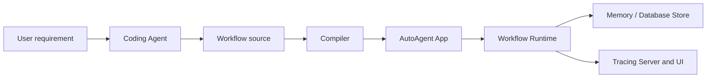

# AutoAgent

[中文](README_ZH.md)

AutoAgent is a code-first framework for building durable, observable AI
Workflows. It combines explicit graph orchestration, typed Python functions,
LLM and Tool integration, persistence, recovery, and tracing in one runtime.

The framework is designed for a development model in which a Coding Agent
translates business requirements into Workflow code, while AutoAgent provides
the stable authoring contract, deterministic compiler diagnostics, execution
runtime, and debugging evidence needed to validate that code.

## Why AutoAgent

AI applications often need more than a single model call. They need branching,
parallel work, loops, external approvals, retries, Tools, structured output,
durable state, and enough execution evidence to explain what happened.

AutoAgent provides these capabilities without hiding control flow inside an
agent loop:

- **Workflow as code** — define Nodes, Edges, Conditions, mappings, policies,
  and child Workflows with typed Python.
- **Compiled execution** — validate graph structure and contracts before an
  Invocation runs.
- **One runtime model** — use the same Scheduler and Executor for ordinary
  automation, LLM calls, Tools, ReAct Workflows, Map, Replication, and Wait.
- **Durable operation** — optionally persist Sessions, Invocations, recovery
  state, Events, and large-value Artifact references to SQLite or PostgreSQL.
- **Built-in observability** — inspect graph movement, timings, retries,
  fallback, Wait/Resume, errors, and detailed state changes.
- **Coding-Agent tooling** — use a stable public API, packaged examples,
  compiler diagnostics, CLI commands, and an authoring Skill.

## How it fits together



Workflow source describes business behavior. The host environment owns App
lifecycle, persistence, concurrency, Provider credentials, and Server
configuration. This separation lets the same Workflow run locally, through the
CLI, inside another service, or eventually on a hosted platform.

## Core capabilities

### Workflow authoring

- sequential, conditional, and parallel graph execution;
- natural Loops, fan-in, dynamic Map, and Replication;
- typed Input Mapping, Output Binding, Conditions, selectors, and aggregators;
- Retry, fallback, timeout, recovery, resource, and failure policies;
- process-local and durable Wait/Resume;
- reusable child Workflows.

### AI building blocks

- a provider-neutral `llm_call` Capability;
- a Chat Completions Provider adapted to the built-in `llm_call` Operator;
- typed Tools generated from Python functions;
- structured model output;
- bounded ReAct Workflows with Tool and output repair.

### Runtime and persistence

The in-memory RuntimeStore is the authoritative latest state. A database backend
persists runtime records asynchronously so normal execution does not wait for
every SQL operation. AutoAgent supports explicit startup recovery, cross-process
Wait/Resume, persistence backpressure, configurable retention, and large-value
externalization through Artifact references.

Each Invocation selects one observation level:

| Mode | Intended use |
| --- | --- |
| `minimal` | Final Invocation state and result with the lowest recording cost |
| `standard` | Production tracing, durable Wait/Resume, and crash recovery |
| `full` | Detailed phase data, state replay, debugging, and future Fork support |

### Tracing

The embedded Server can run standalone or as a FastAPI Router. Its UI combines
the Workflow graph, Invocation state, Inspector, Timeline, replay, Event detail,
and persistence health. Historical data is paged and detailed Event values are
loaded on demand.

## Start with an authored project

AutoAgent projects export one or more Workflow objects from Python modules and
list them in `auto-agent.toml`. The CLI discovers the project, creates the App,
applies runtime configuration, and uses the same compiler and execution path as
an embedded host.

```bash
autoagent project check
autoagent workflow list
autoagent workflow check <workflow-id>
autoagent invocation run <workflow-id> --input-file input.json
autoagent serve --host 127.0.0.1 --port 8765
```

See the packaged [authoring examples](examples/authoring/README.md) for complete
conditional, Wait/Resume, and LLM/Tool/ReAct Workflows. The
[authoring Skill](.agents/skills/autoagent-author-workflow/SKILL.md) describes
the recommended Coding-Agent workflow.

Runtime configuration is supplied through CLI options and environment
variables. [.env.example](.env.example) documents every supported framework
setting.

## Project status

The current foundation includes the public Workflow authoring API, compiler,
runtime execution, SQLite/PostgreSQL persistence, recovery, Runtime Events,
CLI, tracing Server/UI, AI building blocks, packaged examples, and the
authoring Skill.

The next focus is validating Coding-Agent authoring in independent projects,
then building Agent-friendly Invocation reports, progressive trace queries,
rerun/compare, and Fork-based debugging. [MVP.md](MVP.md) defines the product
stages and acceptance boundaries; [TODO.md](TODO.md) tracks current work.

## Development

AutoAgent requires Python 3.12 or newer. Run Python commands through the
repository environment:

```bash
UV_CACHE_DIR=/tmp/autoagent-uv-cache uv run python -m unittest discover -v
```

Build the tracing UI and Wheel with:

```bash
./build.sh
```

Windows PowerShell users can run `./build.ps1`.

Repository areas:

- [`autoagent/`](autoagent/) — Python framework, runtime, persistence, CLI, and
  embedded Server;
- [`ui/`](ui/) — tracing UI source;
- [`examples/`](examples/) — normative authoring examples;
- [`tests/`](tests/) — framework regression and integration tests;
- [`benchmarks/`](benchmarks/) — runtime and persistence measurements;
- [`docs-deprecated/`](docs-deprecated/) — archived design material, not current
  documentation.
