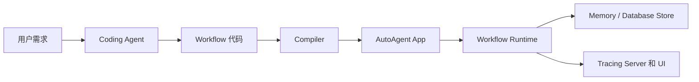

# AutoAgent

[English](README.md)

AutoAgent 是一个用于构建持久、可观测 AI Workflow 的 code-first 框架。它将显式
图编排、类型化 Python 函数、LLM 与 Tool、持久化、恢复和 Trace 统一在一套
Runtime 中。

AutoAgent 面向由 Coding Agent 开发 Workflow 的模式：Coding Agent 将业务需求
转换成 Workflow 代码，AutoAgent 提供稳定的 authoring 契约、确定性的 Compiler
Diagnostic、执行 Runtime，以及验证和调试代码所需的运行证据。

## 为什么使用 AutoAgent

真实 AI 应用通常不只是一次模型调用，还需要分支、并行、循环、外部审批、Retry、
Tool、结构化输出、持久化状态，以及能够解释执行过程的 Trace。

AutoAgent 在不隐藏控制流的前提下提供这些能力：

- **Workflow as code**：通过类型化 Python 定义 Node、Edge、Condition、mapping、
  policy 和子 Workflow。
- **编译后执行**：Invocation 运行前检查图结构和数据契约。
- **统一 Runtime**：普通自动化、LLM、Tool、ReActWorkflow、Map、Replication
  和 Wait 共享同一套 Scheduler 与 Executor。
- **持久化运行**：可将 Session、Invocation、Recovery State、Event 和大对象
  Artifact 引用持久化到 SQLite 或 PostgreSQL。
- **内建可观测性**：查看图流转、耗时、Retry、Fallback、Wait/Resume、错误和
  详细状态变化。
- **面向 Coding Agent 的工具链**：稳定公开 API、随包示例、Compiler
  Diagnostic、CLI 和 authoring Skill。

## 整体结构



Workflow 代码只描述业务行为。宿主环境负责 App 生命周期、持久化、并发、Provider
凭据和 Server 配置。因此同一份 Workflow 可以通过 CLI 在本地运行、嵌入已有服务，
也可以在未来交给托管平台执行。

## 核心能力

### Workflow authoring

- 顺序、条件和并行图执行；
- natural Loop、fan-in、动态 Map 和 Replication；
- 类型化 Input Mapping、Output Binding、Condition、selector 和 aggregator；
- Retry、Fallback、Timeout、Recovery、Resource 和 Failure Policy；
- 具有单一类型化最终输出的同步/异步 `StreamingResult` 执行；
- 通过 snake_case `UserEventMapping` 配置的独立 UserEvent 流，并为 ReAct
  提供标准消息和 Tool 事件、实时 SSE，以及配置 Database Store 后的语义历史持久化；
- 进程内及跨进程 Wait/Resume；
- 可复用子 Workflow。

### AI 基础能力

- Provider 无关的 `llm_call` Capability；
- 适配到内置 `llm_call` Operator 的 Chat Completions Provider；
- 由 NodeExecutor 归并 Provider 流且不持久化临时 chunk；
- 从 Python 函数生成的类型化 Tool；
- 结构化模型输出；
- 支持 Tool 和 output 修复的有界 ReActWorkflow。

### Runtime 与持久化

内存 RuntimeStore 始终保存最新权威状态。配置数据库后端后，Runtime 记录会异步
持久化，普通执行不需要等待每一次 SQL 写入。AutoAgent 支持显式启动恢复、跨进程
Wait/Resume、持久化 backpressure、可配置 retention，以及通过 Artifact 引用
外置大对象。

每个 Invocation 可以选择一种观测级别：

| 模式 | 使用场景 |
| --- | --- |
| `minimal` | 以最低记录成本保存 Invocation 最终状态和结果 |
| `standard` | 生产 Trace、持久化 Wait/Resume 和崩溃恢复 |
| `full` | 详细 phase、状态回放、调试和未来 Fork |

UserEvent 历史与这三种模式正交：语义事件在三种模式下都会持久化；框架内置的
token、reasoning 和 Tool-call delta 只存在于内存与 SSE 中，并由最终权威事件取代。

### Tracing

内嵌 Server 可以独立运行，也可以作为 FastAPI Router 使用。Tracing UI 组合了
Workflow 图、Invocation 状态、Inspector、Timeline、Replay、Event 详情和持久化
健康状态。历史数据采用分页加载，详细 Event 值按需读取。

## 从 Workflow 项目开始

AutoAgent 项目从 Python 模块导出一个或多个 Workflow，并在 `auto-agent.toml`
中列出。CLI 负责发现项目、创建 App、应用运行配置，并复用嵌入式宿主相同的
Compiler 和执行路径。

```bash
autoagent project check
autoagent workflow list
autoagent workflow check <workflow-id>
autoagent invocation run <workflow-id> --input-file input.json
autoagent invocation report <invocation-id>
autoagent invocation query <invocation-id> nodes
autoagent invocation query <invocation-id> node <node-execution-id>
autoagent invocation rerun <invocation-id>
autoagent invocation compare <baseline-id> <candidate-id>
autoagent eval list
autoagent eval check <suite-id>
autoagent eval run <suite-id>
autoagent server --host 127.0.0.1 --port 8765
```

项目通过 ``auto-agent.toml`` 中的 ``[[eval_suites]]`` 显式注册 Evaluation。
``eval list`` 只读取定位信息；``eval check`` 无需 Provider 凭据即可验证选中的
``Evaluation`` 类和 Workflow；``eval run`` 使用正常 App 执行路径和 Full event
mode 运行其 ``eval_*`` Cases。业务预期不匹配返回退出码 1，加载、配置或
Evaluator 基础设施错误返回退出码 2。

`invocation report` 为一次已观测执行生成紧凑的诊断索引；
`invocation query` 按需分页读取 Node、Edge、Operator Call、RuntimeEvent、
UserEvent 或 Full Runtime State 证据。两个命令都会优先连接匹配的运行中 Server，
也可以只读查询显式配置的持久化数据库，不会恢复或重新执行 Workflow。
`invocation rerun` 使用原始 input、入口 Node 和 Genesis Session Context 创建与源
Invocation 相同 Standard 或 Full 模式的隔离候选；Minimal 不支持 Rerun。
`invocation compare` 只接受两个 Standard 或两个 Full Invocation，按 Node、Loop 和
Operator 的语义身份对齐，只报告有界差异，不判断业务结果是否更好。
[Invocation debugging Skill](skills/autoagent-debug-invocation/SKILL.md)
指导 Coding Agent 按照 Report 优先、渐进读取证据、最小修复、Rerun/Comparison
和 Eval 验证的流程调查问题。

完整的条件编排、Wait/Resume 和 LLM/Tool/ReActWorkflow 可以参考随包发布的
[authoring examples](examples/authoring/README.md)。推荐的 Coding Agent 工作方式
记录在 [authoring Skill](skills/autoagent-author-workflow/SKILL.md) 中。

Runtime 配置通过 CLI 参数和环境变量提供；[.env.example](.env.example) 列出了
框架支持的全部配置。

## 当前状态

当前基础能力已经包括：公开 Workflow authoring API、Compiler、Runtime 执行、
SQLite/PostgreSQL 持久化、Recovery、Runtime Event、CLI、Tracing Server/UI、
AI 基础能力、随包示例和 authoring Skill。

当前面向 Coding Agent 的本地流程已经包括有界 Invocation Report、渐进式证据
查询、隔离 Rerun、只读 Comparison 和 Eval 验证。下一步会通过纯 CLI 前向测试
验证完整调试闭环；Fork 仍是后续 Full 模式扩展。
[MVP.md](MVP.md) 定义稳定的产品阶段和验收边界，[TODO.md](TODO.md) 记录当前
工作状态。

## 开发

AutoAgent 要求 Python 3.12 或更高版本。Python 命令通过仓库环境运行：

```bash
UV_CACHE_DIR=/tmp/autoagent-uv-cache uv run python -m unittest discover -v
```

构建 Tracing UI 和 Wheel：

```bash
./build.sh
```

Windows PowerShell 可以运行 `./build.ps1`。

仓库主要目录：

- [`autoagent/`](autoagent/)：Python 框架、Runtime、持久化、CLI 和内嵌 Server；
- [`ui/`](ui/)：Tracing UI 源码；
- [`examples/`](examples/)：规范 authoring 示例；
- [`tests/`](tests/)：框架回归和集成测试；
- [`benchmarks/`](benchmarks/)：Runtime 与持久化性能数据；
- [`docs-deprecated/`](docs-deprecated/)：已归档设计资料，不是当前文档。
