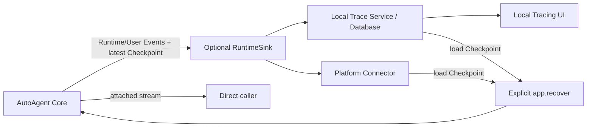
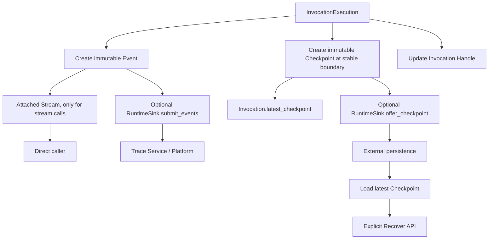

# AutoAgent Core 与本地服务完全重构设计

## 文档状态

本文档记录已经确认的目标架构，作为后续重构的实现依据。当前代码可以用于核对既有执行语义，
但不能作为新结构的模板照搬；`docs-deprecated/` 也不是本次重构的设计来源。

当前 V2 Core 正在 `autoagent_v2/` 中独立实现；每个边界以本文件的契约和 V2 测试共同验证。

## 重构目标

本次重构要解决当前 `RuntimeStore` 同时承担执行状态、Event Journal、数据库生产者、历史查询来源和
恢复状态持有者的问题，将执行、实时调用、观测和持久化拆成明确的数据流。

目标结构：



重构后的核心原则：

- Core 只负责编译、注册和执行 Workflow，维护活动 Session/Invocation，并生成 Event 和 Checkpoint。
- Core 不保存历史 Event，不提供历史查询，不连接数据库，不提供 HTTP、SSE、Projection 或 UI。
- Runtime Event 与 User Event 是追加式数据；Checkpoint 是 latest-wins 数据。它们通过同一个可选
  `RuntimeSink` 离开 Core，但 Attached Stream 仍是独立的直接调用通道。
- Event 是追加式观测事实；Checkpoint 是某个稳定边界的最新可执行状态。
- Core 生成和恢复 Checkpoint，但不负责持久化、扫描或自动加载 Checkpoint。
- Server/Platform 接收 Event 和 Checkpoint，负责持久化、查询、Tracing 和显式触发 Recovery。
- 终态 Invocation 释放重型 Runtime；历史能力不再依赖 Core 内存。
- 当前重构先完成本地 Core 和本地 Server 边界，同时保留未来 Platform Connector 的接入位置。

## 产品与部署分层

### AutoAgent Core

Core 提供：

- Workflow 定义、编译和不可变 Workflow IR。
- Workflow Revision 注册和解析。
- Session 与 Invocation 的进程内执行语义。
- Invoke、Resume、Cancel 和显式 Recovery。
- Wait、Stream、Submit 三种执行方式。
- Runtime Event、User Event 和 Recovery Checkpoint 的生成。
- Checkpoint 恢复验证和 Runtime 重建。
- 同步与异步入口共享的一套执行引擎。

Core 不提供：

- 数据库实现和历史数据查询。
- Trace Projection 和 Tracing UI。
- HTTP、SSE 或平台长连接。
- Checkpoint 的读取、列表、清理和自动恢复扫描。
- 终态 Invocation 历史。

### AutoAgent Server

本地 Server 是 Core 的正式装配层，可以按部署需要组合：

- Project 加载和 Workflow 注册。
- Execution API：Invoke、Resume、Cancel。
- 一个 Runtime Sink、其内部队列和持久化后端。
- 本地 Trace Service、历史查询和 Projection。
- Tracing UI 和查询 SSE。
- 显式恢复扫描与 `app.recover(...)` 调用。

Server 可以运行两种本地形态：

1. 完整本地模式：Core + Execution API + Trace Service + Database + UI。
2. Headless 模式：Core + Execution API + 可选 Event/Checkpoint 出口，不提供本地 UI。

### Future Platform Connector

未来托管容器不需要运行本地 Trace Service 或 UI，只组合：

```text
AutoAgent Core
  + Execution Control Transport
  + Platform Runtime Sink
  + heartbeat / deployment metadata
```

Connector 通过主动长连接或任务租约接收 Invoke、Resume、Cancel、Recover 命令，并把 Event、
Checkpoint 和终态结果发送给中心平台。平台负责持久化、查询、Tracing UI 和跨部署控制。

## Project、App 与 Workflow 注册

### Project

`auto-agent.toml` 描述一个静态 AutoAgent Project，包括 Project 身份和 Workflow 入口位置。
部署配置、数据库、凭据、队列阈值和 Server 地址不属于 Workflow 定义，继续由 CLI、环境变量或平台配置。

一个进程的默认 App 对应一个 Project 部署，可以注册同一 Project 中的多个 Workflow。

### 默认 `AutoAgentApp`

进程内只创建一份轻量默认 App，用于持有只需要一份的执行基础设施：

```python
_default_app = AutoAgentApp()


def get_default_app() -> AutoAgentApp:
    return _default_app
```

导入模块和创建 App 时不能启动线程、创建 Event Loop、连接数据库或发送网络请求。Worker Pool 和
Runtime Loop 在首次需要执行资源时惰性创建。

V1 明确限制一个进程只运行一个 AutoAgent Project 和一套 App 配置。多个 Project 使用多个进程。

### App 所有权

```text
AutoAgentApp
  ├── WorkflowCompiler
  ├── Workflow IR registry
  ├── source Workflow identity index
  ├── Scheduler / Executor services
  ├── bounded Worker Pool
  ├── Runtime Loop
  ├── optional RuntimeSink
  ├── Session registry
  └── active Invocation index
```

共享的是算法和执行资源；以下可变数据必须属于单个 Invocation：

- Scheduler ready/waiting 状态。
- Invocation Context。
- Node execution state 和必要 Node output。
- Worker result mailbox。
- Runtime/User Event sequence。
- 最新可恢复执行状态。

App 不持有：

- 数据库连接和表模型。
- Platform Client。
- 终态 Invocation 历史；每个 Session 只保留最新的轻量 Invocation Handle。
- 已发布 Event 历史。
- Trace Projection。
- Checkpoint 历史或持久化查询接口。

## Workflow 编译与注册

Workflow 是用户编写的可变源对象；Workflow IR 是编译成功后真正被注册和执行的不可变对象。

注册表直接使用 `workflow_id -> WorkflowIR`。Revision 身份属于不可变 IR 本身：

```python
workflow_registry: dict[str, WorkflowIR]

source_workflow_index: dict[
    int,
    tuple[Workflow, str],
]
```

V1 中一个 App 对每个 `workflow_id` 只允许注册一个 Revision。`WorkflowIR.workflow_revision_id` 保存
精确 Revision；历史 Revision 只属于 Server/Platform，不需要让 Core 注册表为不支持的能力增加层级。

注册过程：

```text
app.register_workflow(source Workflow)
  -> compile and validate once
  -> create immutable WorkflowIR
  -> calculate workflow_revision_id
  -> register workflow_registry[workflow_id]
  -> bind source object identity to registered Revision
```

最小 API：

```python
class AutoAgentApp:
    def register_workflow(
        self,
        workflow: Workflow,
    ) -> None: ...
```

规则：

- 注册失败不修改任何索引。
- 同一 `(workflow_id, revision_id)` 注册相同 IR 是幂等操作。
- 同一 `workflow_id` 注册不同 `revision_id` 明确失败；一个 App 只执行该 Workflow 当前加载的一个
  Revision。
- 新 Revision 表示项目代码或 Workflow 定义已经改变，必须创建新的 App 部署并重新注册。
- 历史 Revision 只存在于 Server/Platform 的持久化与查询层，不重新注册进当前 App。
- `register_workflow()` 成功时不需要返回 Workflow IR；无异常即表示注册完成。
- 注册后修改原始 Workflow 不影响已注册 IR。
- Invoke、Resume、Recover 都不能隐式编译或注册 Workflow。
- 当前 App 运行期间不能通过重新注册切换 Revision。
- 传入源 Workflow 时只按已注册对象身份解析，不能重新读取或 Hash 已修改的对象。
- 只传 `workflow_id` 时读取该 ID 下唯一注册的 Revision。
- 传入 `workflow_id + revision_id` 时必须与当前 App 注册的唯一 Revision 精确匹配。

不引入公开的 `ExecutableWorkflow`、`CompiledWorkflow` 或冻结后的 Workflow 包装对象。

## Operator、值契约、Wait 与 Operator Stream

### Operator 身份

普通 Python callable 可以直接作为 Node Operator，不要求装饰器，也不要求它依赖 AutoAgent：

```python
def lookup(city: str) -> Weather:
    ...

workflow.add_node(Node("lookup", lookup))
```

框架在编译时把 callable 包装为不可变 `Operator`。`Operator.id` 可以显式指定；未指定时使用 callable
的方法名。不存在独立的 `Operator.name`，Node 的展示名仍由 `Node.name` 表达。显式 ID、Version、输入
Schema 和输出 Schema 都属于 Revision 定义。V2 Core 暂不引入 `OperatorRef`、`CapabilityRef` 或远程实现
解析；它们属于以后 Server/Platform 的扩展能力。

### 可恢复值契约

Core 承诺 Checkpoint 可以安全序列化、反序列化并跨进程恢复，因此所有用户自定义执行函数都必须声明
明确的参数和返回类型。编译器检查 Operator、Input Mapping、Output Binding、Edge Condition、Map Item
Selector、Aggregator、User Event Transform 和 Stream Reducer：

- 禁止缺失注解、`Any`、`object`、裸 `list`/`dict` 等不完整契约。
- Mapping 的 Key 必须是 `str`。
- 允许 JSON 标量、UUID、Enum、带完整参数的容器、TypedDict，以及定义在可导入模块顶层的 dataclass
  和 Pydantic Model。
- 禁止局部类、不可导入类型、文件句柄、连接、线程、Generator 本身等无法可靠重建的对象。
- `ContextPatch` 中的实际值同样必须满足可恢复值边界；不能因为返回类型写成 `ContextPatch` 就绕过
  序列化检查。
- 编译期检查声明，运行期还要验证真实输入、返回值、Stream Chunk 和 Hook 结果，防止错误实现或动态
  数据破坏 Checkpoint。

这不是“尽量序列化，失败时丢字段”的 Codec。V2 Core 不提供有损回退；不能保证恢复的 Workflow 在
注册时直接失败，运行时产生越界值则使当前 Node/Invocation 明确失败。

### WaitOperator

Wait 是框架预定义 Operator，不要求业务函数返回 `WaitRequest` 等框架模型：

```python
Node(
    "approval",
    WaitOperator(
        request_type=ApprovalRequest,
        response_type=ApprovalResponse,
    ),
    input_mapping=build_approval_request,
    output_binding=save_approval_response,
)
```

- `request_type` 和 `response_type` 都必须是上面的安全值类型，不能是 `Any` 或 `object`。
- 普通 `input_mapping` 构造并校验 Wait Request；进入 Waiting 后 Request 保存在最新 Checkpoint。
- `resume(..., response)` 校验 Response；普通 `output_binding` 在 Resume 后原子写入 Context。
- 不符合 Response Contract 的 Resume 命令在重新启动执行前被拒绝，Invocation 保持 Waiting，可以提交
  正确 Response 后继续。
- Wait Node 不执行普通 callable，不配置 Fallback、Map、Replication、Retry 或 StreamPolicy。
- Resume 仍然完成同一个 Wait Node，然后由原有 Edge 和 Scheduler 继续，不创建一个隐式后继 Node。

### StreamPolicy

Operator 可以返回原生同步或异步流，但必须在返回注解中明确 Chunk 类型，并在 Node 上配置
`StreamPolicy`：

```python
def tokens(prompt: str) -> Iterator[str]:
    ...

class TextReducer:
    def __init__(self) -> None:
        self.parts: list[str] = []

    def add(self, chunk: str) -> None:
        self.parts.append(chunk)

    def finish(self) -> str:
        return "".join(self.parts)

Node(
    "generate",
    tokens,
    policy=NodePolicy(stream=StreamPolicy(reducer=TextReducer)),
)
```

`StreamPolicy` 只接收 Reducer Class。编译器要求它定义在可导入模块顶层、可以无参数创建，并提供同步
`add(chunk) -> None` 和 `finish() -> Result`；`chunk` 必须匹配 Operator 的 Stream Chunk，`Result` 成为
Node 的正式输出契约。每次 Operator Attempt 创建一个新 Reducer；框架逐个验证 Chunk、调用 `add()`、
产生可选的 Stream User Event，流结束后验证 `finish()` 的 Result。未配置 StreamPolicy 却声明/返回流，
或配置 StreamPolicy 但 Operator 不是流，都明确失败。原始 Chunk 是瞬时数据，Checkpoint 和下游 Node
只保存归并后的正式 Result。

## Session

Session 是 App 管理的纯数据对象，不包含 Workflow 执行方法：

```python
@dataclass
class Session:
    id: str
    workflow_id: str
    context: SessionContext
    invocation: Invocation | None
    created_at_ms: int
    updated_at_ms: int
```

Session 不绑定 Revision，每个 Invocation 固定自己的 `workflow_revision_id`。当前 App 中一个
`workflow_id` 只有一个 Revision；项目重新部署并注册新 Revision 后，外部 Server/Platform 仍可把同一
Session 身份和 Context 交给新 Invocation，而不需要把 Session 身份永久锁死在旧 Revision 上。

规则：

- Session 只能用于相同 `workflow_id`。
- `session.invocation` 直接持有该 Session 最新的 Invocation Handle，不只保存 ID。
- `created`、`running`、`waiting` 都属于活动状态。
- Session 有活动 Invocation 时拒绝第二个 Invoke。
- Waiting Invocation 保留在 Session 中供 Resume 使用。
- Invocation 终止后不清除 `session.invocation`；重型 `InvocationExecution` 仍然释放，但 Session 保留
  最新的轻量终态 Handle，便于进程内读取最新状态和结果。
- 下一次 Invoke 到来时，如果现有 Handle 已终态，则用新的 Invocation Handle 替换它；外部已经持有的
  旧 Handle 不受影响。
- Session 只保存最新一个 Invocation，不保存终态 Invocation 列表。

App 维护：

```python
sessions_by_id: dict[str, Session]
```

Session 只有一个 ID 概念：

- 用户传入 `session_id: str` 时直接使用该值。
- 用户不传时由 Core 生成 `str(uuid4())`。
- Session ID 在一个 App 内全局唯一；已有相同 ID 但 `workflow_id` 不同则明确失败。
- 不再提供独立的 Session key，也不维护第二套索引。

## Invocation Handle 与内部执行对象

公开的 `Invocation` 是轻量控制和结果 Handle；内部 `InvocationExecution` 保存重型执行状态。

```python
class Invocation:
    id: UUID
    workflow_id: str
    workflow_revision_id: str
    session_id: str

    @property
    def state(self) -> InvocationState: ...

    @property
    def output(self) -> dict[str, object] | None: ...

    @property
    def error(self) -> RuntimeErrorInfo | None: ...

    @property
    def latest_checkpoint(self) -> RecoveryCheckpoint | None: ...

    def snapshot(self) -> InvocationSnapshot: ...
    def done(self) -> bool: ...
    def wait(self, timeout: float | None = None) -> Invocation: ...
    async def await_done(self, timeout: float | None = None) -> Invocation: ...
    def result(self) -> dict[str, object]: ...
```

Invocation 不提供 Invoke、Resume、Cancel 或 Event 历史查询方法；这些操作统一属于 App。

`InvocationExecution` 包含：

- Workflow IR 引用。
- Scheduler 和 scope 状态。
- Session/Invocation Context 的执行视图。
- Node execution state 和必要 outputs。
- Mailbox 和进行中的 task 引用。
- Event sequence。
- Checkpoint 捕获所需状态。

终态清理：

```text
create detached terminal Event
  -> RuntimeSink accepts Event ownership, when configured
  -> compact final state/output/error onto Invocation Handle
  -> remove active Invocation index
  -> release InvocationExecution
  -> keep compact Handle as session.invocation until next Invoke replaces it
```

外部仍然持有 Handle 时可以读取最终结果，但 Core 不再持有完整 Runtime 或 Event 历史。

## Execution API

### 两个正交维度

执行操作：

- Invoke：创建新的 Invocation。
- Resume：为现有 Waiting Invocation 提交响应并继续。
- Recover：从外部提供的 Checkpoint 重建 Invocation。
- Cancel：取消活动 Invocation。

执行方式：

- Wait：等待 Invocation 到达下一个 Waiting 或 Terminal 边界。
- Stream：附着执行并实时迭代 Event。
- Submit：接纳后立即返回，后台继续执行。

支持矩阵：

| 操作 | Wait | Stream | Submit |
|---|---:|---:|---:|
| Invoke | 是 | 是 | 是 |
| Resume | 是 | 是 | 是 |
| Recover | 是 | 是 | 是 |
| Cancel | 独立控制方法 | 不适用 | 不适用 |

### 扁平公开 API

为了让 Coding Agent、类型检查器和 IDE 容易理解，不引入 `app.stream.invoke(...)` 代理对象，使用
明确的扁平方法：

```python
class AutoAgentApp:
    # Wait style
    def invoke(...) -> Invocation: ...
    async def ainvoke(...) -> Invocation: ...

    def resume(invocation: Invocation | UUID, response: object = MISSING) -> Invocation: ...
    async def aresume(...) -> Invocation: ...

    def recover(checkpoint: RecoveryCheckpoint) -> Invocation: ...
    async def arecover(...) -> Invocation: ...

    # Stream style
    def stream_invoke(...) -> InvocationStream: ...
    def astream_invoke(...) -> AsyncInvocationStream: ...

    def stream_resume(...) -> InvocationStream: ...
    def astream_resume(...) -> AsyncInvocationStream: ...

    def stream_recover(checkpoint: RecoveryCheckpoint, ...) -> InvocationStream: ...
    def astream_recover(...) -> AsyncInvocationStream: ...

    # Submit style
    def submit_invoke(...) -> Invocation: ...
    async def asubmit_invoke(...) -> Invocation: ...

    def submit_resume(...) -> Invocation: ...
    async def asubmit_resume(...) -> Invocation: ...

    def submit_recover(checkpoint: RecoveryCheckpoint) -> Invocation: ...
    async def asubmit_recover(...) -> Invocation: ...

    # Control
    def cancel(invocation: Invocation | UUID) -> Invocation: ...
    async def acancel(...) -> Invocation: ...
```

同步和异步方法必须进入同一条内部执行路径，不能维护两套 Runtime 语义。

### 各方式的边界

Wait：

- `invoke` 创建并启动 Invocation，等待首次 Waiting 或 Terminal。
- `resume` 继续 Waiting Invocation，等待下一次 Waiting 或 Terminal。
- `recover` 重建 Checkpoint；如果 Checkpoint 可继续运行，则等待下一次 Waiting 或 Terminal；如果原本
  就是 Waiting，则恢复完成后立即返回 Waiting Handle。
- Wait 不是 Workflow Wait Node 的公开操作，只是调用方等待执行边界。

Stream：

- Stream 在执行开始前建立临时 attached stream。
- 调用方每请求一个 Event，Core 才继续推进到下一个被选中的 Event。
- Invocation 到达 Waiting 或 Terminal 时当前 Stream 结束。
- 调用方主动关闭 Stream 时默认 Cancel 当前 Invocation。
- `stream_recover` 先完成 Checkpoint 验证和 Runtime 重建，再开始输出恢复执行产生的新 Event；不会重放
  Checkpoint 之前的历史 Event。

Submit：

- `submit_invoke` 和 `submit_recover` 先通过新执行准入，再创建 Invocation；接纳完成后立即返回 Handle。
- `submit_resume` 不创建新 Invocation，因此不经过新执行准入；Resume 请求被接纳后立即返回同一个 Handle。
- `submit_recover` 完成 Checkpoint 验证、Session 占用和 Runtime 重建后返回；可运行状态在后台继续，Waiting
  状态保持 Waiting。
- “立即返回”表示通过准入并完成内存接纳后返回，不表示忽略 RuntimeSink 背压；准入本身可以等待到配置的
  超时。
- Submit 不创建供调用者稍后读取的 Event backlog。

Cancel：

- Cancel 只接受活动 Invocation Handle 或 ID。
- Cancel 请求立即设置取消信号并尽快停止尚未完成的执行任务，不受新执行准入限制。
- Invocation Coordinator 把 Invocation 改成 Cancelled，并生成有序的取消 Runtime Event。
- 配置 RuntimeSink 时，`cancel()` / `acancel()` 在该取消 Event 被 Sink 接管后才返回同一个 Handle；不要求
  Event 此时已经持久化。没有 RuntimeSink 时，完成内存取消后即可返回。
- 如果 Sink 正在背压，执行取消本身仍立即发生，但 Cancel 调用的完成可以等待 Event 被接管。
- Core 不能为了让 Cancel 更快返回而跳过或丢弃取消 Event。
- 调用者可以用 `wait()` / `await_done()` 等待其他尚未收敛的取消清理完成。
- Server 的 Cancel API 只调用 App，不修改 Runtime 数据对象。

### 返回值

| 方法类型 | 返回值 |
|---|---|
| Wait | 到达 Waiting/Terminal 的 `Invocation` |
| Stream | `InvocationStream` / `AsyncInvocationStream` |
| Submit | 接纳完成的 `Invocation` |
| Cancel | 同一个 `Invocation` |

不增加独立 `InvocationResult`。多出口业务结果、Waiting 和 Error 都通过同一个 Invocation Snapshot 表达。

## Attached Stream

Attached Stream 是调用 API 的临时实时通道，不是 Event Sink，也不是历史订阅服务。

```python
stream = app.stream_invoke(...)

for event in stream:
    render(event)

invocation = stream.invocation
result = invocation.result()
```

异步形式：

```python
stream = app.astream_invoke(...)

async for event in stream:
    await render(event)

result = stream.invocation.result()
```

默认流只输出 User Event：

```python
event_channel: Literal["user", "runtime", "all"] = "user"
```

- `user`：应用和 Agent UI 使用的 User Event。
- `runtime`：诊断和调试使用的 Runtime Event。
- `all`：按 Core 产生顺序输出两种 Event 的联合类型。

即使 Workflow 没有产生 User Event，Stream 仍会在 Waiting/Terminal 时结束，最终状态和结果从
`stream.invocation` 获取。终态结果不强行伪装成 User Event。

Stream 规则：

- Stream 是严格 caller-driven 的 pull 模型，不是后台生产加有界缓存：

  ```text
  next() / __anext__()
    -> Core 推进 Invocation 到下一个被选择的 Event
    -> 先把 Event 提交给 RuntimeSink
    -> 向调用者 yield Event
    -> Invocation 的逻辑推进暂停
    -> 调用者再次请求 next() 后继续
  ```

- 调用方处理当前 Event 的期间，Scheduler、状态提交和后续 Event 生成暂停。已经发出的 HTTP、线程池或
  并行 Operator 任务可能继续运行，并把结果放入有界 mailbox，但它们不能自行提交 Runtime 状态或分配
  Event sequence。
- 未被 `event_channel` 选中的 Event 仍提交给 RuntimeSink，但不会造成一次 `yield`。
- 主动关闭 attached Stream 默认立即 Cancel Invocation；关闭完成前同样等待取消 Event 被 RuntimeSink
  接管。
- Server 的 Trace SSE 不是 Attached Stream；UI 断开绝不能取消 Invocation。
- Submit 不允许执行结束后再从 Handle 创建 Attached Stream；需要历史时查询 Server/Platform Journal。

Server 的常规 Execution API 使用 Submit + RuntimeSink；只有明确要求 request-bound 流式执行时才使用
Attached Stream。Core 不公开笼统的 Event Hub 或 Subscriber 领域对象。

## Runtime Event 与 User Event

Runtime Event 和 User Event 是两套独立序列：

```python
workflow_id: str
workflow_revision_id: str
session_id: str
invocation_id: UUID
sequence: int
occurred_at_ms: int
```

两种 Event 各自在单个 Invocation 内从 1 开始递增。是否增加跨两种 Stream 的共同顺序不在本次重构中
引入。

Event 在交给 RuntimeSink 或 Attached Stream 前必须：

- 已确定 sequence 和发生时间。
- 与 Session Context、Node output 等可变 Runtime 解除引用。
- 是不可变、可序列化的值。
- 不要求 Sink 后台再次访问 Invocation Runtime。

Runtime Event 保存距离上一条 Runtime Event 的增量 Operations，而不是当时 Runtime 的全量副本：

```text
Genesis state
  + RuntimeEvent 1.operations
  + RuntimeEvent 2.operations
  + ...
  -> state at target sequence
```

纯观测 Event 可以使用空 Operations。并行 Worker 只返回结果、chunk 和 timing 到 Invocation mailbox；只有
Invocation Coordinator 可以按状态实际提交顺序应用修改、分配 sequence 并生成 Event，因此并行完成顺序
不会破坏增量链。

### Event capture mode

Core 保留 `minimal`、`standard`、`full` 三种采集模式，因为 Full Event 的 Operations、输入输出复制和
内部阶段构造成本发生在 Core，不能让 Core 永远产生 Full 后再由 Server 丢弃。

- Minimal：不生成 Runtime Event，只生成 Recovery Checkpoint 和 User Event。
- Standard：增加图级状态、Node、Edge、Operator Call 和 Timing 事实。
- Full：增加内部阶段、输入输出和 Runtime Operations，支持详细 Debug、Replay 和 Fork。

Checkpoint 独立于 capture mode。三种模式都可以生成完整 Recovery Checkpoint，因此跨进程恢复不再
强制依赖 Full Event。

## RuntimeSink 与背压

Core 最多配置一个只写 `RuntimeSink`。Event 使用追加式接纳语义，Checkpoint 使用 latest-wins 语义：

```python
class RuntimeSink(Protocol):
    async def wait_until_admissible(self) -> None:
        """Wait until a new Invocation may be admitted."""

    async def submit_events(
        self,
        events: tuple[SerializedEvent, ...],
    ) -> None:
        """Return after atomically accepting every Event into Sink memory."""

    def offer_checkpoint(
        self,
        checkpoint: SerializedCheckpoint,
    ) -> None:
        """Non-blocking latest-wins Checkpoint offer."""
```

Core 不解释 high/hard 水位、队列长度、批量大小、重试、spool 或数据库可用性。这些规则全部由具体 Sink
实现；Core 只依赖上面的行为契约。队列水位和持久化健康状态由 Server/Platform 自己查询和暴露，不放进
最小 `RuntimeSink` 协议。

### 新执行准入

- `invoke` 和 `recover` 的 Wait、Stream、Submit 入口都必须在分配 Session/Invocation Runtime 前调用
  `await runtime_sink.wait_until_admissible()`。
- `admission_timeout` 是 Core/App 的调用参数；Core 在 Sink 调用外侧计时，不能把 timeout 语义委托给
  每一种 Sink 实现。
- 同步入口通过同一 Runtime bridge 阻塞等待；不能绕过该检查。
- Sink 正常返回后才创建 Invocation；Core 超时或 Sink 协议异常表示准入失败，并且不能留下半创建的
  Session 或 Invocation。
- Resume 继续既有 Invocation，不属于新执行准入；它产生的 Event 仍受 `submit_events()` 背压。
- Submit 的“立即”从准入成功后开始计算。它可以在准入阶段等待，但不要求调用者实现外部重试循环。
- 没有配置 RuntimeSink 时，准入直接通过。

### 运行中 Event 提交

Core 对每批已冻结的 Event 执行：

```python
await runtime_sink.submit_events(events)
```

每次提交的具体顺序是：

```text
Invocation Coordinator applies one logical state transition
  -> assign sequence and freeze immutable Event(s)
  -> retain Event(s) in the Invocation delivery slot
  -> await RuntimeSink.submit_events(Event batch)
  -> Sink accepts ownership of the complete batch
  -> clear delivery slot
  -> notify attached stream / waiters when applicable
  -> continue Scheduler and the next logical transition
```

一个 batch 只能包含已经发生且 sequence 连续的 Event，不能为了凑批而跨越尚未提交的 Runtime 状态。
不同 Invocation 可以并发调用 `submit_events()`，Sink 必须保持每个 Invocation、每个 Event 序列内部有序；
不要求不同 Invocation 之间存在全局顺序。

`submit_events()` 不返回 `True/False`：

- 正常返回表示 Sink 已接管这一批中的每条 Event；不表示已经写入数据库或被平台确认。
- Sink 暂时没有容量时保持 coroutine pending。Core 暂停当前 Invocation 的逻辑提交，但 Runtime Loop 和
  其他 Invocation 仍可运行。
- 普通的数据库不可用、重试和队列拥塞由 Sink 内部处理，不能用 `False` 把丢弃决定推回 Core。
- Core 在调用前保留当前 Event 的交付边界，只有 Sink 接管后才释放相关不可变 Event 数据并继续。
- Sink 的显式降级或丢弃策略只能发生在 Sink 内部，并必须由 Sink 暴露和记录；Core 永远不主动丢弃
  Runtime Event、User Event 或 Cancel Event。
- `submit_events()` 的实现不应接触数据库或网络，因此正常的后端故障不会从该方法抛出。若 Sink 已关闭或
  实现损坏而违反协议，Core 记录明确错误并对该 Invocation 脱离 Sink；业务执行仍然继续。Server 后续通过
  自己的健康接口暴露不可观测/不可恢复状态。
- Waiting 或 Terminal 的 App 调用结果也只能在对应边界 Event 被 Sink 接管后返回；这样“调用成功返回”与
  “Sink 已拥有该执行边界”具有一致含义。
- Cancel 调用者即使停止等待，也不能取消 Invocation 内部的取消收敛与 Event 交付任务；该任务继续到 Sink
  接管取消 Event，或暴露不可恢复的 Sink 基础设施错误。

Core 在调用 Sink 前已经完成 Event 序号分配、Runtime value 规范化和不可变 UTF-8 JSON 序列化。Sink
可以在后台批量写数据库或发送平台；Executor 等待的只是“内存所有权转移”，而不是 durable
acknowledgement。Sink 积压的是已经与 Runtime 解除引用的序列化 Event，而不是完整
`InvocationExecution`。

### 单一 Sink 与日志

- App 支持零个或一个 RuntimeSink。没有 Sink 时 Core 正常执行，但没有外部 Event 历史；最新 Checkpoint
  仍可从 Invocation 读取。
- 本地 Server 注入 `DatabaseRuntimeSink`，平台 Worker 注入 `PlatformRuntimeSink`。
- 需要本地缓冲、spool 或双写时，由具体 Sink 在内部组合；未来可以由外部实现
  `CompositeRuntimeSink`，但 Core 仍只看到一个 Sink，V1 不内建多 Sink fan-out。
- 普通执行日志使用 Python logging，不作为可靠 Event Sink，也不参与背压。
- App 首次执行后不能替换 RuntimeSink。由 Server/平台创建的 Sink 也由装配层负责 flush 和 close，App
  只停止自身执行资源。

## Recovery Checkpoint

### 定义

Checkpoint 是某个稳定执行边界的完整、不可变、可执行状态，只保存继续执行需要的数据：

```python
@dataclass(frozen=True)
class RecoveryCheckpoint:
    schema_version: int

    workflow_id: str
    workflow_revision_id: str
    session_id: str
    invocation_id: UUID

    invocation_state: InvocationState
    runtime_event_sequence: int
    user_event_sequence: int

    invocation_input: JsonValue
    session_context: JsonObject
    invocation_context: JsonObject

    scheduler_state: SchedulerCheckpoint
    node_states: tuple[NodeCheckpoint, ...]
    required_outputs: JsonObject
    wait_state: WaitCheckpoint | None

    created_at_ms: int
```

精确字段在实现阶段根据 Scheduler/Executor 的最小恢复状态确定，但 Checkpoint 不包含：

- Runtime/User Event 列表。
- Trace Projection。
- 完整 Operator Call 历史。
- Input Mapping、Output Binding 等调试记录。
- UI 数据。
- 与继续执行无关的历史 Node output。

Map/Replication 只保存恢复需要的聚合进度和必要 output，不保存无界 Call 历史。

### 生成边界

Core 只在确定可恢复的稳定边界生成 Checkpoint：

1. Invocation 初始化完成：Revision、Input、Session/Invocation Context 和 Scheduler 初始状态已确定。
2. Scheduler 稳定边界：当前执行批次完成，Output Binding 和 Edge 决策已提交，下一批 Node 尚未启动。
3. Waiting：Wait Token、等待位置和全部前置状态已经提交。

不在以下位置生成：

- 每个 Runtime Event 后。
- Input Mapping 或 Output Binding 执行一半时。
- 单个并行 Node 完成、同批其他 Node 尚未收敛时。
- Operator 或用户函数执行中间。

长时间 Operator 中崩溃时，从 Node 开始前的最近 Checkpoint 恢复并根据 Node Recovery Policy 判断是否
允许重跑。

终态不生成完整可恢复状态。RuntimeSink 在接管 terminal Runtime Event 后，把外部最新 Checkpoint 标记为
不可恢复；具体数据库清理策略属于 Sink/Server。

### Checkpoint 出口

Checkpoint 与 Event 共用同一个 RuntimeSink 接口，但使用不同语义。`offer_checkpoint()` 是非阻塞的
latest-wins offer，不参与 Event 队列水位和新执行准入；Sink 可以覆盖同一 Invocation 尚未持久化的旧
Checkpoint。

Core 行为：

- 每次生成 Checkpoint 时更新 `Invocation.latest_checkpoint`。
- 配置 RuntimeSink 时同步快速 `offer_checkpoint()`。
- 没有 Sink 时仍然可以直接从 Invocation Handle 取得最新 Checkpoint并自行保存。
- 不等待数据库写入，不维护 Checkpoint 历史。

Server 行为：

- 接收已经序列化的 Checkpoint 后异步 upsert 最新状态。
- 可覆盖同一 Invocation 的旧 Checkpoint。
- 记录 accepted、pending、durable、failed 状态。
- 从持久化后端读取 Checkpoint 后显式调用 App Recovery API。

Core 的 `waiting` 只表示执行状态，不表示 Checkpoint 已持久化。官方 Server 如果要承诺跨进程 Resume，
应在对外声明“durable waiting”前确认该 Waiting Checkpoint 已写入；失败时仍可同进程 Resume，但必须明确
显示 `checkpoint_not_durable`。

### Checkpoint 与 Event 的关系

正常恢复路径直接使用 Core 生成的最新 Checkpoint：

```text
Core stable boundary
  -> RecoveryCheckpoint
  -> Server/Platform stores latest
  -> explicit app.recover(checkpoint)
```

Full Runtime Event 可以作为备用来源：

```text
Genesis state + ordered Full Runtime Events
  -> Core Recovery Reducer
  -> RecoveryCheckpoint
  -> app.recover(checkpoint)
```

因此：

- Checkpoint 是跨进程 Resume/Recovery 的主要数据。
- Event 是 Tracing、Debug、Replay 和 Fork 的主要数据。
- Full Event 重建 Checkpoint用于修复、审计或 Checkpoint 缺失场景，不是正常恢复必须路径。
- Server 可以把构建出的 Checkpoint 单独保存，但 Core 不关心它是否被称为缓存或持久化 Checkpoint。

## Recovery 语义

Recovery 永远显式触发，App 不在启动时扫描外部存储，也不在 Invoke 时惰性恢复。

`recover` 的内部步骤：

```text
validate checkpoint schema
  -> resolve exact registered Workflow Revision
  -> validate serialized contracts
  -> reject terminal/invalid checkpoint
  -> atomically reserve Session and Invocation identity
  -> restore Session and Invocation Context
  -> restore Scheduler, Node states, outputs and sequences
  -> mark Invocation as recovery mode
  -> expose lightweight Invocation Handle
  -> continue if runnable; remain waiting if checkpoint is waiting
```

规则：

- 必须注册 Checkpoint 指定的精确 Workflow Revision。
- 不允许用当前注册的其他 Revision 替换 Checkpoint 中缺失或不匹配的 Revision。
- 相同 Invocation 已活动时拒绝重复 Recovery。
- 相同 Session 已有活动 Invocation 时拒绝 Recovery。
- Waiting Checkpoint 恢复后不自动消费 Wait Response；后续使用 Resume API。
- Runnable/Interrupted Checkpoint 从恢复边界后台继续，并逐 Node 应用 Recovery Policy。
- 遇到禁止 Recovery 的 Node 时按既有 Workflow fail-fast/skip 语义终止或传播。
- 恢复后的 Runtime/User Event sequence 从 Checkpoint 继续递增。
- Recovery 产生的新 Event 正常进入 Attached Stream 和 RuntimeSink，不重放历史 Event。

三种恢复调用方式：

- `recover/arecover`：等待恢复后的下一 Waiting 或 Terminal；原 Checkpoint 已 Waiting 时立即返回。
- `stream_recover/astream_recover`：实时读取恢复后新产生的 Event。
- `submit_recover/asubmit_recover`：重建接纳后立即返回，后台继续。

## Event、Stream 与 Checkpoint 的最终关系



关键依赖方向：

```text
InvocationExecution -> Attached Stream -> direct caller
InvocationExecution -> RuntimeSink.submit_events -> external journal
InvocationExecution -> RuntimeSink.offer_checkpoint -> external latest state
external persistence -> caller loads Checkpoint -> app.recover(...)
```

不存在：

- Invocation Handle 从 RuntimeSink 反向读取 Event。
- Server 轮询每个 Invocation 获取完整 Event。
- Core 从 RuntimeSink 查询历史 Event 或恢复状态。
- Trace SSE 断开后取消 Invocation。
- Submit 后再建立完整历史订阅。

## Server 查询与流式边界

Execution API 与 Trace API 是两个独立服务面：

### Execution Control

- Invoke、Resume、Cancel。
- 请求映射到 App 的 Submit 风格入口。
- 返回 Invocation ID 和接纳状态。
- 可选 request-bound attached stream，但它与 Trace SSE 的生命周期规则不同。

### Trace Query

- Workflow Revision、Session、Invocation 列表。
- Runtime/User Event 分页。
- Projection、Report、Artifact 和状态查询。
- 只查询 Server/Platform Journal，不查询 Core 历史内存。

### SSE

- Execution Stream：与一次调用绑定，按明确策略决定断开是否取消。
- Trace Subscription：只通知 Journal 变化，断开不影响执行，并可按 sequence 继续查询。

## CLI 位置

CLI 是最外层 composition root，不包含执行或持久化业务逻辑：

```text
autoagent workflow check/preview
  -> ProjectLoader + Compiler

autoagent invocation run/resume
  -> App direct execution or remote Server client

autoagent eval run
  -> App + transient/full evidence collectors

autoagent serve
  -> ProjectLoader
  -> configure App
  -> register Workflow IR
  -> create and configure one RuntimeSink
  -> recover selected external Checkpoints
  -> start Execution and Trace APIs
```

未来平台 Worker 也是另一种 composition root，不改变 Core API。

## 生命周期与关闭顺序

App 只关闭自己拥有的执行资源，不关闭由 Server 注入的外部 Sink 或数据库连接。

Server 启动：

```text
load Project
  -> create one DatabaseRuntimeSink or PlatformRuntimeSink
  -> configure default App
  -> compile/register declared Workflows
  -> load external recoverable Checkpoints
  -> explicitly submit_recover each selected Checkpoint
  -> start accepting requests
```

Server 关闭：

```text
stop new admission
  -> reject new Invoke/Resume/Recover
  -> wait or cancel active Invocations within grace period
  -> stop App Executor/Worker Pool/Runtime Loop
  -> flush RuntimeSink Events and latest Checkpoints
  -> close RuntimeSink
  -> close Database/Platform client
```

如果进程强制终止，只能恢复到外部最后成功持久化的 Checkpoint；Core 已生成但仍在外部队列中的
Checkpoint 不构成跨进程可靠性承诺。

## V1 实现边界

本次重构实现时保持以下限制：

- 一个进程一个 Project、一个默认 App。
- Workflow 必须显式注册，Invoke 不编译。
- Session 一次只允许一个活动 Invocation。
- Core 不保留终态历史。
- Core 不实现数据库或历史查询。
- Checkpoint 是完整最新状态，不维护 Checkpoint 增量 Journal。
- Event 和 Checkpoint 都必须在离开 Executor 前与可变 Runtime 解除引用。
- Attached Stream 默认输出 User Event；Runtime Event 需要显式选择。
- Submit 只返回状态/结果 Handle，不提供迟到的 Event 回放。
- Cross-process Recovery 必须由外部保存 Checkpoint 并显式调用 Recovery API。
- Full Event Replay/Fork 继续存在，但不作为正常 Recovery 的唯一基础。
- 暂不实现中心平台托管、远程 Workflow、远程 Operator 或 Capability Registry。

## 后续实施顺序

设计确认后，按以下顺序实施，每一步独立验证，不在一次修改中同时替换全部系统：

1. 定义新的公开 App、Invocation、InvocationStream 和 RecoveryCheckpoint 契约。
2. 将活动 Session/Invocation Runtime 从历史 Journal 和数据库职责中分离。
3. 实现统一的 Invoke/Resume/Recover 内部路径和 Wait/Stream/Submit 外部方式。
4. 实现独立 Attached Stream，删除 Invocation Receiver 和 Submit 后订阅旧路径。
5. 实现单一 RuntimeSink、准入和运行中 Event 背压契约。
6. 在稳定 Scheduler 边界生成 Checkpoint，并通过同一 RuntimeSink latest-wins offer。
7. 实现显式 Recovery 重建和三种 Recovery 调用方式。
8. 将本地 Trace Service 改为只查询 Server Journal/Backend。
9. 重构 Execution API、Trace API、SSE 和 UI 数据源。
10. 迁移 CLI、Evaluation、Report、Rerun 和 Compare 到新 composition root。
11. 删除旧 RuntimeStore 中已经失去职责的 Journal、Persistence 和查询代码。
12. 完成正确性、并发、恢复、背压、关闭和性能对比测试。

开始实现前，需要再次按当前源代码列出迁移切面和测试矩阵；本文不授权立即修改现有 Runtime。
