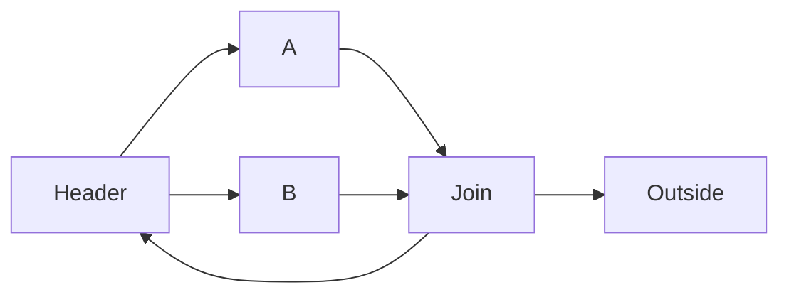
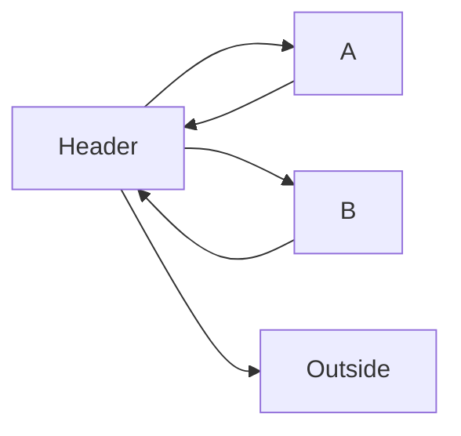
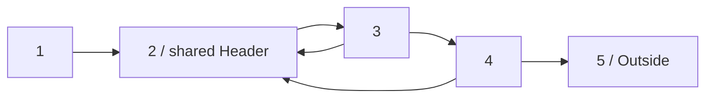
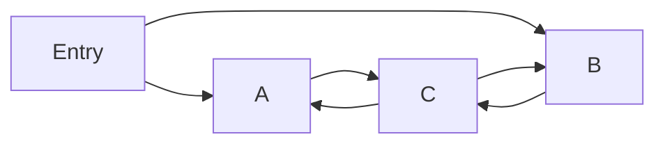
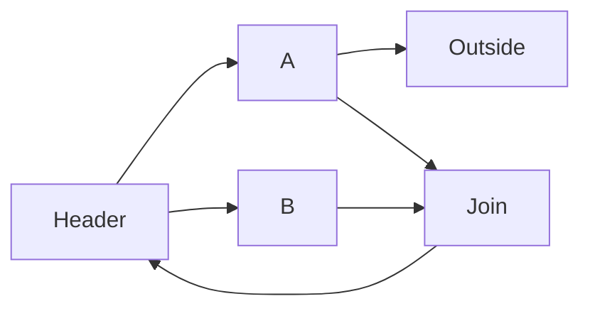
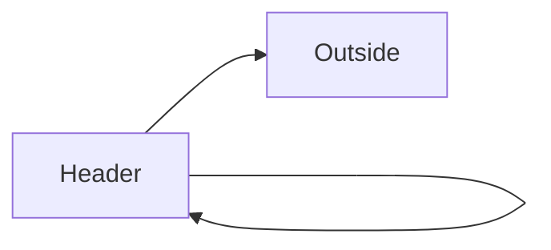

# AutoAgent V2 Workflow Semantics

## Status and Scope

This document is the complete normative Workflow contract for AutoAgent V2. It
defines authoring, compilation, control flow, data flow, type contracts,
scheduling, Loop scopes, Map/Replication, Wait/Resume, Checkpoint recovery,
failure atomicity, termination, diagnostics, and performance boundaries.

Compiler, Scheduler, Executor, Runtime, persistence adapters, and tests must
implement the same semantics. The document is independent of AutoAgent V1 and
does not describe a migration from an older implementation. Server APIs,
Runtime Event payload presentation, tracing projections, and UI layout are
separate contracts, but they may not change the execution semantics defined
here.

This contract does not contain an implementation-gap or migration checklist.
Conformance of any implementation is measured separately through diagnostics,
tests, and implementation TODOs; missing implementation work cannot weaken a
rule in this document.

## Quick Reference

| Topic | Allowed | Rejected or required behavior |
|---|---|---|
| Entry/Exit | multiple structural Entries and Exits | no Entry, no Exit, or unreachable Node |
| Fan-out | every true outgoing condition is selected | first-match/implicit Router semantics |
| Fan-in | wait for every selected/skipped incoming occurrence in one scope | first-arrival Join |
| Parallel Loop | branches reconverge at an explicit Join before one Back Edge | independent Latches treated as one Loop |
| Loop ownership | one Header, one Latch, one Back Edge, at least one Exit | irreducible, multi-entry, or partially overlapping region |
| Same Header | mutually exclusive sibling Loops or unambiguous strict nesting | sibling Body cross-Edges or simultaneous sibling entry |
| Loop decision | compatible Internal fan-out or compatible Exit fan-out | Back/Internal together with Exit for the same Loop |
| Node input | typed Invocation input, one activation value, or explicit Input Mapping | ambiguous multi-activation input without a valid mapping/contract |
| Node output | one typed logical output per Node Execution | exposing unordered physical Map completion as logical output |
| Context write | one validated atomic `ContextPatch` from Output Binding | partial patch application or parallel overlapping writes |
| Map/Replication | bounded physical Calls, ordered logical results | unbounded task creation or partial aggregation after unit failure |
| Wait | one durable `wait_id` per waiting Node occurrence; other branches continue | treating one waiting Node as immediate Invocation termination |
| Resume | exactly-once claim, typed response, original scope restored | guessing a Wait by Node id or consuming one response twice |
| Checkpoint | latest executable, quiescent Runtime state | deriving recovery only from tracing Events or persisting in-flight mutation |
| Safety | finite Node, Call, parallel-unit, and size budgets | an unbounded Loop/Map hidden behind conditional control |

## Core Principles

1. A Workflow is a static directed graph. Conditions select graph transitions
   at runtime but do not change the compiled topology.
2. Ordinary DAG Nodes and Edges keep one scheduling model: all-matches fan-out
   and complete fan-in over selected/skipped Edge occurrences.
3. A Loop does not introduce a second Node or Edge execution model. It adds
   compile-time regions, iteration-scoped occurrences, and boundary checks.
4. An author must use an explicit Join to express parallel work that belongs to
   one Loop iteration.
5. Arbitrary Python conditions cannot be proven mutually exclusive. The
   Compiler rejects structural and unconditional contradictions; Runtime
   validates actual selected Edges atomically.
6. Every Node has an implicit execution-count limit so a condition bug cannot
   run an Invocation forever.
7. Every user value crossing a Node, Context, Wait, or Checkpoint boundary has
   an explicit durable type contract and is validated before it is committed.
8. A Node Execution is the atomic business-state commit unit. Operator side
   effects are external; Context and graph state become visible only after a
   successful Output Binding commit.
9. Checkpoints and Runtime Events are different products: a Checkpoint is the
   latest executable state, while Events are append-only observations.

## Terminology

### Workflow Definition and Workflow IR

A `Workflow` is the mutable authoring object. Successful compilation produces
an immutable `WorkflowIR`. Runtime executes only `WorkflowIR`; later mutation of
the source `Workflow` does not affect registered execution.

### Node and Node Execution

A **Node** is a static graph definition. A **Node Execution** is one runtime
occurrence of that Node in one Invocation and one execution scope.

The same Node may execute:

- once in an acyclic path;
- once for each Loop iteration;
- once in several nested Loop scope combinations;
- many times across different Invocations.

### Edge and Edge Occurrence

An **Edge** is a static dependency and transition from one Node to another. An
**Edge Occurrence** is the selected/skipped result for one source Node Execution
and one target scope. Results from different Loop iterations are never merged.

### Activation and Logical Value

An **Activation** is a selected Edge occurrence delivered to its target. It
contains the Edge id, source Node id, source Node Execution id, source scope,
and the source Node's committed logical output. A skipped Edge occurrence
participates in readiness but carries no value.

A **Logical Node Input/Output** is the single typed value observed at the Node
boundary. Map/Replication may execute many physical Operator Calls, but those
Calls are internal to one logical Node Execution.

### Context and Context Patch

A **HookContext** is the common isolated view supplied to Workflow hooks. It
contains Session Context, Invocation Context, original Invocation input,
Workflow/Revision/Session/Invocation identity, and Workflow path. Node Hook
subtypes add the current Node Execution, execution scope, and exact incoming
Activations; phase-specific subtypes add only their own input, output, or
ordered Operator outputs. Edge conditions receive an `EdgeConditionContext`
with the exact source output and scope.

Hooks do not receive a global output, Node-state, or Edge-state lookup. Data
from an earlier Node must arrive through an exact Activation or be explicitly
committed to Session/Invocation Context. Core uses Python `deepcopy` to isolate
values exposed to user code. JSON encoding/decoding is a separate persistence
boundary and is never used as a substitute for Hook isolation.

A **ContextPatch** is the only Workflow-level write produced by Output Binding.
It targets Session Context and/or Invocation Context and is validated and
committed atomically.

Session Context belongs to one `(workflow_id, session_id)` conversation and may
be observed by later Invocations in that Session. A Session is associated with
the Workflow id, not one Revision; each Invocation records the exact Revision
it executes. Invocation Context belongs to one Invocation and is never shared
with another Invocation. At most one Invocation may actively mutate a Session
at a time.

### Wait and Checkpoint

A **Wait** is one suspended Node occurrence identified by an opaque `wait_id`.
It retains its Node Execution, activation set, execution scope, request value,
and expected response contract.

A **Checkpoint** is a versioned, self-contained snapshot of the latest safe
execution boundary. It is sufficient to reconstruct Session/Invocation
Context, Scheduler state, Loop scopes, Waits, counters, and required outputs
without replaying observational Runtime Events.

### Workflow Entry Node

A **Workflow Entry Node** has no incoming Edge. A Workflow may have multiple
Entry Nodes; they are initially ready in parallel.

`Node.entry=True`, when supported by the authoring API, is an assertion that the
Node is structurally an Entry Node. It does not hide other Nodes with no incoming
Edges, and compilation fails if the declared Entry has an incoming Edge.

### Workflow Exit Node

A **Workflow Exit Node** has no outgoing Edge. A Workflow may have multiple Exit
Nodes. An Edge with a condition that happens to evaluate false does not turn its
source into a structural Exit Node.

### Loop Terms

For a Loop `L`:

- **Loop Region**: the Nodes participating in the cycle. An Exit target outside
  the cycle is not part of the region.
- **Loop Header**: the unique entry/control Node that dominates every Node in
  the region.
- **External Entry Edge**: an Edge whose target is the Header and whose source
  is outside the Loop region.
- **Loop Body Node**: any region Node other than the Header. The Latch may also
  be a Body Node.
- **Loop Latch**: the source Node of the Back Edge.
- **Back Edge**: the single Edge that returns from the Latch to the Header.
- **Loop Internal Edge**: an Edge whose source and target are both inside the
  region and which is not the Back Edge.
- **Loop Exit Edge**: an Edge whose source is inside the region and target is
  outside the region.
- **Loop Exit Source**: the source of an Exit Edge. It may be the Header, a
  middle Body Node, or the Latch; there is no required unique Loop Exit Node.
- **Loop Iteration**: one scoped execution of the region beginning at its Header
  and continuing until a Back, Exit, failure, cancellation, or invalid no-route
  boundary. A Wait suspends the current iteration without ending it.

Workflow Entry, Workflow Exit, Loop Header, Loop Latch, and Loop Exit Source are
different roles and must not be conflated.

## Node Rules

### Identity and Reachability

- Node ids are non-empty and unique after child Workflow expansion.
- Every Node must be reachable from at least one Workflow Entry Node.
- A Node may belong to zero, one, or several Loop regions.
- Loop membership is ordered from outermost to innermost and forms a valid scope
  hierarchy, except that mutually exclusive sibling Loops may share one Header.

### Node Readiness

Except for Workflow Entry Nodes and Loop Header activation rules described
later, a Node occurrence becomes ready only after every expected incoming Edge
occurrence in the same execution scope is resolved.

- If at least one incoming Edge is selected, the Node is scheduled once with
  all selected activations.
- If every incoming Edge is skipped, the Node occurrence is skipped and its
  outgoing Edge occurrences are resolved as skipped.
- A Node is never scheduled twice for the same occurrence key.

This is complete fan-in. It is not a first-arrival Join.

### Node Occurrence State Machine

Every Node occurrence has one state. The allowed transitions are:

```text
pending -> ready -> running -> completed
    |         |        |  \-> waiting -> resuming -> completed
    |         |        |         |           \----> failed
    |         |        |         \----------------> cancelled
    |         |        \--------------------------> failed/cancelled
    |         \-----------------------------------> cancelled
    \---------------------------------------------> skipped/cancelled
```

- `pending` means one or more expected incoming Edge occurrences remain
  unresolved.
- `ready` means complete fan-in has resolved with at least one selected
  Activation.
- `running` covers Input Mapping, selection, physical Calls, aggregation,
  stream reduction, Output Binding, and outgoing-condition evaluation.
- `waiting` and `resuming` are legal only for `WaitOperator`.
- `completed`, `failed`, `skipped`, and `cancelled` are terminal for that
  occurrence key.

Retry and fallback are Operator-attempt transitions inside `running`; they do
not create a new Node occurrence. A terminal occurrence is never resurrected.

### Node Completion and Outgoing Evaluation

A successful Node Execution follows this graph-relevant order:

1. construct the logical input from its activations and Input Mapping;
2. execute the Operator, including Map/Replication when configured;
3. aggregate the logical Node output when required;
4. apply Output Binding transactionally;
5. evaluate every outgoing Edge condition from one committed read-only Context
   snapshot;
6. atomically validate and submit the outgoing decisions to Scheduler.

Map/Replication may create many Operator calls, but it still produces one
logical Node completion and one outgoing Edge evaluation. It counts as one Node
Execution for the Node execution limit; Operator attempts use separate limits.

## Data Flow and Type Contracts

### Durable Value Contract

Every value that can cross an execution or recovery boundary must have an
explicit, safely reconstructable type. This includes:

- Invocation input and final outputs;
- Operator parameters, normal returns, and stream chunks;
- Input Mapping and aggregation results;
- Output Binding patches;
- Session and Invocation Context values;
- Wait request and Resume response values;
- User Event data when it is retained or persisted;
- every value stored in a Checkpoint.

Supported contracts are recursively typed scalars and containers plus stable,
importable structured types such as Enum, `TypedDict`, dataclass, and Pydantic
models. `Any`, `object`, unresolved/local types, bare containers, generators as
durable values, process-local handles, open files, sockets, tasks, locks, and
arbitrary class instances are not durable contracts.

Compilation validates declared annotations and compatibility between adjacent
phases when it can do so statically. Runtime validates every actual value at the
phase boundary. A contract error fails the current Node before any Context or
outgoing graph transition is committed.

### Incoming Activation Bundle

Selected incoming Activations are ordered by compiled incoming Edge order, not
by physical completion time. The canonical hook representation is an ordered
tuple of records:

```text
IncomingActivation(
    edge_id,
    source_node_id,
    source_execution_id,
    source_scope,
    value,
)
```

`NodeHookContext.incoming` exposes this exact ordered bundle. Edge id is the
stable key; source Node id alone is insufficient because several Edges may
share one source. The bundle contains only selected Activations. Skipped Edge
occurrences are observable through Scheduler/Runtime state but never appear as
input values.

### Default Logical Input

Input Mapping is optional only when the logical input is unambiguous:

| Activation state | Default logical input |
|---|---|
| structural Entry with no Activation | validated Invocation input |
| exactly one selected Activation | that Activation's committed value |
| more than one selected Activation | no implicit merge; Input Mapping is required |
| every incoming Edge skipped | Node is skipped; no input is constructed |

A Node with several static incoming Edges may omit Input Mapping only if the
Compiler can prove that at most one selected value can reach one occurrence and
that the value contract matches the Operator. Arbitrary Python conditions are
not generally sufficient proof, so an explicit Input Mapping is normally
required for a multi-incoming Node.

Input Mapping receives one read-only `InputMappingContext` and returns exactly
one typed logical input. It may inspect the Activation bundle, Invocation
input, and Session/Invocation Context, but it cannot mutate live Runtime state.
Failure produces a failed Input Mapping phase followed by a failed Node state;
no Operator Call is started.

### Operator Input and Output

The logical input is bound to the Operator signature by its declared contract:

- one value binds to one positional parameter;
- a typed mapping may bind named parameters when its keys match the signature;
- missing, extra, variadic, or incompatible values fail before the handler is
  called;
- the return value is validated as the declared logical unit output.

A normal Node uses the validated Operator return as its logical output. A
streaming Operator uses a declared `StreamPolicy` reducer to consume typed
chunks and produce one validated final logical output. Stream chunks are
transient execution data unless another contract explicitly retains them.

### Output Visibility

Outputs are identified internally by Node Execution id. A convenience
latest-output view may be keyed by Node id, but it is not sufficient for
recovery or Loop fan-in because the same Node can execute in many scopes.
Activations always reference the exact source Node Execution output.

The Invocation result is a mapping from every structural Exit Node that
completed successfully to that Exit occurrence's final committed logical
output. Skipped Exit Nodes contribute no value. A successfully settled Workflow
may therefore return an empty mapping.

### Output Binding Transaction

Output Binding receives one `OutputBindingContext`; its `input` and `output`
fields are isolated Python values, and its common state is the same logical
snapshot used for that Node Execution. It returns `ContextPatch` or no patch.
Commit follows this order:

1. execute Output Binding against the isolated snapshot;
2. validate every patch path and value contract;
3. verify the patch is durably serializable;
4. detect overlap with Context paths committed since the Node's snapshot;
5. apply the entire patch atomically;
6. publish the Node output and completed state together;
7. only then evaluate outgoing Edge conditions.

If any step before commit fails, neither Session Context nor Invocation Context
changes and the logical output is not visible to downstream Nodes. There is no
partial patch application.

Parallel Node Executions may commit disjoint paths in either completion order.
Equal paths and ancestor/descendant overlaps are conflicts when based on stale
snapshots; Runtime fails the later commit rather than applying last-writer-wins.
Workflow code must use an explicit Join/aggregator when concurrent branches
need to combine one logical value.

Output Binding atomicity covers AutoAgent Context and graph state only. Core
cannot roll back external side effects already performed by an Operator.
Recovery-safe Operators must therefore be replay-safe or accept a stable
idempotency key according to their recovery policy.

## Map and Replication Semantics

### Logical and Physical Execution

Map and Replication are Node execution policies, not graph expansion. One Node
occurrence owns:

- one Input Mapping;
- one ordered set of physical Operator Calls;
- zero or one aggregation;
- one logical output;
- one Output Binding commit;
- one outgoing Edge decision set.

Physical Calls never create Node occurrences, Loop frames, or independent
outgoing Edge evaluations.

### Map Input Selection

Map first receives the Node's typed logical input. Its Item Selector has the
contract:

```text
ItemSelectorContext(input=LogicalInput) -> finite ordered list[OperatorInput]
```

The selector result is validated before any unit starts. Unit index is the list
index and remains stable for tracing, retry, aggregation, and recovery.

A selector-less Map is legal only when the logical input itself has one
unambiguous, typed finite sequence contract whose item contract matches the
Operator input. For a Loop Header, external-entry and Back activation values
are separate occurrences and must each be unambiguous. Multiple possible
values require Input Mapping or an Item Selector; completion order is never an
implicit selection rule.

### Replication Input

Replication has a positive fixed or policy-resolved count. Every replica
receives an isolated copy of the same typed logical input. Replication has no
Item Selector. Ambiguous incoming Activations must be resolved by Input Mapping
before replication begins.

### Bounded Concurrency and Ordering

Map/Replication uses both the Node policy maximum and the App-wide physical
Call limit. The effective concurrency is the smaller positive limit. The
Executor must use a bounded worker queue; creating one pending task per unit is
not an acceptable implementation for an unbounded input.

Calls may start and complete out of order. Results are stored and presented to
the aggregator in unit-index order. Without an aggregator, the logical Node
output is the ordered list of unit outputs.

### Unit Failure and Cancellation

Retry, timeout, fallback, Call-attempt limits, and idempotency apply to each
physical Call independently. The V2 business contract is atomic
all-or-nothing Node completion:

- one terminal unit failure fails the Node;
- no aggregation or Output Binding occurs with a partial output set;
- queued units are not started after terminal failure;
- active units receive cancellation requests and their eventual results are
  discarded from the logical output;
- every started physical Call still produces its terminal Call status;
- Invocation failure policy decides whether other graph branches continue.

Business-level partial success must be represented explicitly in the Operator
output type, for example `UnitResult[Value, BusinessError]`; it is not inferred
from infrastructure exceptions.

An empty Map performs no Operator Calls. It invokes the aggregator with an
empty ordered list when configured; otherwise its logical output is an empty
list. Replication count cannot be zero.

### Map/Replication and Wait/Streaming

`WaitOperator` cannot use Map or Replication. A streaming Operator may be
mapped/replicated only when every unit has a typed reducer producing one final
unit output. Transient chunks must be tagged with Node Execution id and unit
index; stream delivery order across units is not a logical result ordering
guarantee.

## Execution Safety

### Implicit Node Execution Limit

Every compiled Node inherits a positive maximum execution count per Invocation,
even when the author does not configure one. A host/framework default supplies
the limit; an allowed explicit resource policy may override it.

The counter is keyed by Node id within the Invocation and includes executions
across every Loop scope. Exceeding it fails the Invocation with:

```text
NODE_EXECUTION_LIMIT_EXCEEDED
```

The error evidence must include:

- Node id;
- attempted and allowed execution counts;
- current execution scope;
- current Loop iteration stack.

This limit is a runtime safety net. It does not make a structurally endless
Workflow legal. Operator attempts, Map/Replication units, Retry attempts, and
Invocation-wide runtime/work budgets are separate concerns.

## Edge Rules

### Condition Contract

An Edge condition is optional:

- `condition is None` means the Edge is unconditionally selected whenever its
  source Node completes successfully;
- otherwise the condition must return `bool` or an awaitable `bool`;
- conditions receive a read-only `EdgeConditionContext` view;
- every condition for one source Node observes the same committed snapshot;
- condition evaluation does not move data into the target Node by itself.

Authors should make conditions deterministic and side-effect free. Core can
prevent mutation through its supplied Context view, but Python cannot prevent a
condition from reading or mutating module globals, files, remote services, or
other external state. Such behavior is unsupported for deterministic replay and
cannot be rejected reliably by compilation.

### All-Matches Fan-Out

Outgoing Edges do not use first-match Router semantics. All conditions are
evaluated and every true Edge is selected.

Consequently:

- several ordinary internal/DAG Edges may be selected to create parallel work;
- several compatible Exit Edges may be selected to create parallel work outside
  a Loop;
- a false Edge is explicitly resolved as skipped;
- Runtime validates Loop compatibility only after the full decision set is
  known and before any selected target is scheduled.

### Scoped Complete Fan-In

Incoming Edge occurrences are matched by target Node and execution scope. A
resolution from iteration 2 cannot satisfy an incoming dependency in iteration
3. Multiple selected activations are delivered together; skipped activations
participate in readiness but do not contribute values.

## Acyclic Graph Semantics

A Workflow with no directed cycle needs no Loop policy:

1. all structural Entry Nodes start ready;
2. completed Nodes evaluate all outgoing conditions;
3. selected Edges fan out;
4. target Nodes wait for complete selected/skipped fan-in in their occurrence;
5. skipped Nodes propagate skipped outgoing occurrences;
6. execution completes after no ready/running/waiting work remains and all
   reachable branches have settled at structural Workflow Exit Nodes or failure.

The introduction of Loop support must not change this DAG behavior.

## Compile-Time Loop Analysis

### Conditions Are Ignored for Topology

The Compiler analyzes every declared Edge when finding reachability, SCCs,
dominators, Back Edges, Loop regions, entries, and exits. It cannot assume a
conditional Edge will be true or false at runtime. `condition is None` may be
used only for additional guaranteed-conflict checks after topology is known.

### Strongly Connected Components

A directed cycle belongs to a cyclic strongly connected component (SCC),
including a one-Node SCC with a self-Edge.

Every cyclic SCC must:

- be reachable from a Workflow Entry;
- be representable as reducible/natural Loop regions under the rules below;
- have at least one Edge leaving the whole SCC.

An Exit from one contained Loop into another contained Loop does not count as
leaving the SCC.

### Header and Back-Edge Recognition

For candidate Edge `u -> h`, `h` is a valid Header for that Back Edge only when
`h` dominates `u`: every path from a Workflow Entry to `u` passes through `h`.
The natural region is computed by walking predecessors backward from `u` to
`h`, bounded by the Header.

A valid compiled Loop has:

- one Header;
- exactly one Back Edge;
- exactly one Latch, the Back Edge source;
- no external Edge entering a non-Header region Node;
- at least one structural Exit Edge.

The one-Back-Edge restriction is intentional. Parallel branches belonging to a
single Loop must reconverge before one shared Latch.

### One Parallel Loop



The Back Edge is `Join -> Header`; the region is `{Header, A, B, Join}`. Both
`Header -> A` and `Header -> B` are internal and may be selected together.

### Same-Header Sibling Loops



Independent Back Edges define separate sibling Loops:

```text
Loop A = {Header, A}, Back = A -> Header
Loop B = {Header, B}, Back = B -> Header
```

Sibling regions may intersect only at the shared Header. Their Body Nodes must
be disjoint and may not have cross-Edges that bypass the Header. Header choices
entering different sibling Bodies are mutually exclusive at runtime.

This shared-Header case is an allowed exception to the general rule that
non-nested Loop regions must be disjoint. It remains reducible because the
Header is the unique gateway and sibling scopes cannot be active together.

An author who intends A and B to run in parallel in one iteration must add an
explicit Join and one shared Back Edge. Core never treats the Header as an
implicit Join across independent Back Edges.

### Nested Loops

Loop regions are nested when their Node sets are in a strict subset relation:

```text
nodes(inner) < nodes(outer)
```

Nested regions form a parent/child hierarchy. Headers may be different or, when
the topology is unambiguous, shared.

Example with one shared Header:



```text
Inner = {2, 3}, Back = 3 -> 2, Exit = 3 -> 4
Outer = {2, 3, 4}, Back = 4 -> 2, Exit = 4 -> 5
```

One Edge may have different roles by Loop level:

| Edge | Inner | Outer |
|---|---|---|
| `1 -> 2` | External Entry | External Entry |
| `3 -> 2` | Back | Internal |
| `3 -> 4` | Exit | Internal |
| `4 -> 2` | new Inner entry | Back |
| `4 -> 5` | outside | Exit |

The shared Header executes once for one activation cause; entering a new Outer
iteration must not schedule a duplicate Header occurrence for the new Inner
scope.

### Region Relationships

For any two compiled Loop regions, exactly one relationship is allowed:

1. disjoint;
2. strict containment in either direction;
3. sibling regions sharing only the same Header and satisfying the sibling
   restrictions above.

Partial overlap without containment is rejected. For example:



Candidate cycles `{A, C}` and `{B, C}` overlap at C but neither contains the
other, and neither has a unique dominating Header for the entire cyclic flow.
Representing it would require crossing token scopes rather than a Loop scope
stack. Compilation fails; V2 does not implement Petri-net or irreducible-cycle
semantics.

### Structural Exit Requirements

Every Loop region must have at least one Edge from a region Node to a Node
outside that region. Every cyclic SCC must additionally have an Edge leaving
the entire SCC.

Example:

```text
1 -> 2 -> 3
3 -> 2
3 -> 1
```

```text
Inner = {2, 3}; 3 -> 1 is an Inner Exit.
Outer = {1, 2, 3}; 3 -> 1 is the Outer Back.
```

The Outer Loop has no Exit and the SCC has no external Exit, so compilation
fails even though the Node execution limit would eventually stop runtime.

An Exit Edge with a condition counts as a structural Exit, because the Compiler
cannot prove whether its condition will be true. Runtime handles the case where
all boundary conditions are false.

### Static Condition Conflicts

After Loop roles are classified, the Compiler examines unconditional Edges.
For every source Node and every Loop containing that Node:

- one or more unconditional internal/Back Edges plus one or more unconditional
  Exit Edges is a guaranteed control conflict and compilation fails;
- multiple unconditional compatible internal Edges are legal fan-out;
- multiple unconditional Exit Edges are legal only when they close the same set
  of Loop scopes;
- multiple unconditional entries into different same-Header sibling Loops are
  a guaranteed conflict and compilation fails.

Conditions that are present but semantically overlap cannot generally be proven
invalid and are checked at runtime.

## Runtime Loop Scope

### Scope Stack

Every Node/Edge occurrence carries an ordered execution scope:

```text
(OuterLoop, outer_iteration) / (InnerLoop, inner_iteration)
```

Iterations begin at 1. The stack contains only active nested scopes. Sibling
Loop scopes never coexist in one stack.

### Header Activation Groups

A Header does not wait on all static incoming Edges indiscriminately. Each
activation group is identified by at least:

```text
header_node_id
loop_id
parent_scope
target_iteration
activation_kind  # entry or back
```

Rules:

- External Entry occurrences and Back occurrences are different groups and do
  not wait on each other.
- Multiple External Entry Edges in the same parent scope use complete fan-in;
  all must resolve selected/skipped before the Header enters iteration 1.
- A Back starts the next iteration of its owning Loop and does not wait for Back
  Edges belonging to sibling or nested Loop ids.
- Re-entry into a nested Loop creates a fresh inner iteration 1 for the current
  parent iteration.
- An old Edge occurrence can never satisfy a new activation group.
- Simultaneous incompatible activation groups targeting the same Header
  occurrence fail rather than scheduling the Header twice.

Because every Loop has one Back Edge, a Header never acts as an implicit Back
fan-in for one Loop.

### Nested Iteration Transitions

- Inner Back increments only the Inner iteration and preserves the current
  Outer frame.
- Inner Exit removes the Inner frame and preserves the Outer frame.
- Outer Back closes the current Outer frame, increments the Outer iteration,
  and recreates any entered Inner scope from iteration 1.
- One selected Edge may atomically exit several nested Loop scopes.
- Recovery/Resume must restore the exact scope stack; it must not infer the
  current iteration from static Node ids.

### Sibling-Loop Transitions

At a shared Header reached from Loop A's Back, the Header may select exactly one
compatible transition:

- enter Loop A again;
- exit Loop A and enter sibling Loop B;
- exit the cyclic region through a real outside Edge.

It may not enter Loop A and Loop B together, or enter one while also selecting a
real outside Exit.

## Runtime Outgoing-Edge Compatibility

### Per-Loop Classification

For one completed Node and every Loop `L` containing it, classify every selected
outgoing Edge relative to `L`:

```text
continue(L): target remains in L, including L's Back Edge
exit(L): target is outside L
```

The selected decision is legal only when:

```text
not (continue(L) is non-empty and exit(L) is non-empty)
```

This check is repeated independently for every containing Loop. Consequently,
two Back Edges owned by different nested Loops can be mutually incompatible
without a separate special-case rule.

The check applies to the current outgoing decision and unresolved parallel
boundary decisions. It does not compare an Exit against every Internal Edge
traversed earlier in the iteration; otherwise a normal Body path could never
reach an Exit.

### Multiple Exit Edges

Multiple selected Exit Edges are legal fan-out only when they close exactly the
same set of active Loop scopes.

For nested `Inner < Outer`:

- two Edges that both leave Inner but stay in Outer are compatible;
- two Edges that both leave Inner and Outer are compatible;
- an Edge that leaves only Inner and another that leaves both Inner and Outer
  are incompatible, because relative to Outer one is internal and one is exit.

Targets are not scheduled until the entire outgoing set passes validation.

### Back/Exit Conflict

Selecting a Back and an Exit for the same Loop boundary is invalid, whether the
decisions came from one Node or from unresolved parallel branches:

```text
LOOP_BACK_EXIT_CONFLICT
```

The Runtime applies no partial scope transition and schedules no outside target
before reporting the conflict.

## Parallel Loop and Early Exit Stabilization

An explicit Join identifies normal parallel iteration completion, but an Exit
may originate before that Join:



If A selects `A -> Outside` while B remains active:

1. record the Exit as a pending boundary decision;
2. do not schedule Outside yet;
3. continue already active in-Loop work until the current Loop reaches a stable
   boundary;
4. commit compatible Exit decisions only when no branch selected Back or an
   incompatible exit depth;
5. fail atomically if a conflicting Back/Exit decision appears.

A pending Exit does not cancel another branch automatically. This preserves
Operator cancellation and side-effect semantics and avoids making Loop exit an
implicit fail-fast policy.

If another branch reaches a Wait Node, the Loop is waiting rather than stable
for Exit commit. The pending Exit remains uncommitted until Resume settles the
remaining branch or the Invocation is explicitly cancelled/failed.

This is a Loop-boundary stabilization rule, not a general Node batch barrier.
Fast internal Nodes continue scheduling downstream internal work without
waiting for unrelated Nodes in a previously drained ready set.

## Wait and Resume Semantics

### WaitOperator Contract

Wait is expressed by a framework-owned `WaitOperator[Request, Response]` with
explicit durable request and response contracts. It follows normal Node data
flow:

1. Input Mapping constructs and validates the Wait request;
2. the Node Execution creates a new opaque `wait_id`;
3. the Node enters `waiting` without producing output or evaluating Edges;
4. Resume validates the response as the logical Node output;
5. normal Output Binding commits the response;
6. the Node completes and evaluates outgoing Edges.

Request and response are user-defined durable types; neither may be `Any`.
`wait_id` is unique per waiting Node occurrence and is not the Node id. The same
Node can create different Waits across Loop iterations, and several Nodes may
wait concurrently.

### Invocation State While Waiting

A waiting Node suspends only its own occurrence and keeps its exact Loop scope
alive. Other ready/running graph branches continue normally. Therefore:

- the existence of a Wait does not immediately set Invocation state to
  `waiting`;
- the Invocation remains `running` while any other work can progress;
- the Invocation becomes `waiting` only at a quiescent boundary with at least
  one unresolved Wait and no ready/running work;
- pending Loop Back/Exit decisions remain uncommitted while an in-scope Wait
  can still affect stabilization.

The complete Invocation state machine is:

```text
created -> running -> completed
               |  \-> failed
               |  \-> cancelled
               \----> waiting -> running
                            |  \-> failed
                            \----> cancelled
```

`created` contains validated Invocation identity and input but no started Node.
`running` means at least one Node is ready/running/resuming or Scheduler work can
still progress. `waiting` is a quiescent, resumable state, not a terminal state.
A successful Resume changes `waiting` to `running`; after that work settles, the
Invocation may become `waiting` again if other Waits remain. `completed`,
`failed`, and `cancelled` are terminal and immutable.

### Resume State Machine

Resume requires the Invocation identity, exact `wait_id`, and one response:

```text
waiting --claim(wait_id)--> resuming --commit--> completed Node
```

Rules:

- claiming a Wait is atomic; concurrent duplicate claims allow exactly one
  winner;
- an unknown, completed, cancelled, or already-claimed `wait_id` is rejected;
- Resume may occur while the Invocation is still `running` because another
  branch is active;
- response contract failure fails the waiting Node without applying Output
  Binding;
- Output Binding failure leaves Context unchanged and fails the Node;
- successful Resume removes only the claimed Wait and restores its original
  activation bundle and scope before normal downstream scheduling;
- remaining Waits continue to exist independently.

Resume does not re-run Input Mapping or the pre-Wait Operator phase. It resumes
the suspended Node with the stored request/activation state and the validated
response.

### Timeout and Cancellation

A Wait may carry an absolute durable deadline. Relative timeouts are converted
to that deadline when the Wait is committed so restart does not reset the
clock. On expiry, Runtime atomically claims the Wait and fails its Node with
`WAIT_TIMEOUT`. Producing a default business response is not an implicit timeout
behavior; an author who needs it must model that response through an explicit
typed Workflow path.

There is no implicit per-Wait cancellation that fabricates a response.
Invocation cancellation:

- cancels every outstanding Wait and active Node;
- discards uncommitted Back/Exit transitions;
- emits no downstream activation from a cancelled Wait;
- preserves already committed Context and external Operator side effects.

## Checkpoint, Recovery, and Partial Execution

### Checkpoint Is Executable State

A Checkpoint is independent from Runtime Events. Events may be filtered,
batched, retained, or unavailable; recovery correctness must not require
reducing an Event journal. Conversely, a Checkpoint is not a tracing projection
and does not need to retain every historical phase.

The Runtime produces a latest-wins Checkpoint only at an executable boundary:

1. after Invocation creation, validation, and Scheduler initialization, before
   the first Node starts;
2. at a quiescent runnable boundary after all completed Node commits and
   Scheduler transitions are applied, before the next ready work starts;
3. at a quiescent waiting boundary after all Waits and pending Loop decisions
   are committed.

Core does not checkpoint a partially applied Output Binding, an unresolved
condition set, or mutable state owned by an in-flight Node. If a process fails
during in-flight work, recovery returns to the preceding executable boundary
and replays work only under the Node's recovery policy.

### Minimum Checkpoint Contents

A versioned Checkpoint contains at least:

- schema version, Workflow id, exact Workflow Revision id, Session id, and
  Invocation id/state;
- original Invocation input;
- complete Session and Invocation Context values at the boundary;
- ready Node requests and their ordered activation bundles;
- selected/skipped Edge resolutions still needed for complete fan-in;
- every active Loop scope frame and iteration number;
- pending Back/Exit boundary decisions and their owning scope;
- outstanding Wait records including `wait_id`, request, Node Execution,
  activation bundle, response contract identity, deadline, and scope;
- exact outputs referenced by ready activations, Waits, or final-result state;
- latest committed output identity per Node where the Context view requires it;
- Node execution, Operator attempt/runtime, recovery-attempt, and other safety
  counters;
- Runtime/User Event sequence watermarks when downstream protocols require
  monotonic continuation;
- the original Invocation creation time and Checkpoint creation time.

Data may be compacted only when no retained Scheduler, Wait, Context, result,
or recovery reference can observe the removed value.

### Persistence Boundary

Core creates and offers Checkpoints; a Server, platform, or user adapter owns
durable storage. Offering a newer Checkpoint may replace an older one for the
same Invocation, but storage must never expose a torn record. Checkpoint
acceptance and Event delivery use separate interfaces and pressure policies.

The Invocation may continue after a non-blocking Checkpoint offer. A failed
offer degrades cross-process recoverability and must be surfaced as explicit
infrastructure health; it must not roll back an already committed business
Node. A host that promises durable-before-continue behavior may impose a
stronger admission/execution barrier outside the Workflow semantics.

### Recovery Validation and Reconstruction

Recovery is explicit. Runtime validates the complete Checkpoint before
executing anything:

- schema version is supported;
- the exact Workflow Revision is registered;
- every Node, Edge, Loop, scope relationship, and contract identity exists in
  that Revision;
- scope stacks are properly nested and iteration numbers are positive;
- Scheduler resolutions reference valid occurrence keys;
- Context, outputs, requests, responses, and counters satisfy their contracts;
- Wait ids are unique and Node states agree with Invocation state;
- no terminal Invocation is recovered as runnable.

After validation, Runtime restores Context, outputs, counters, Scheduler ready
state, pending boundaries, scope stacks, and Waits exactly. It does not infer an
iteration from the current Node id, recompute already committed conditions, or
reapply committed Output Bindings.

Runnable Nodes that were not committed in the Checkpoint are replayed according
to `RecoveryPolicy`:

- `never`: stop recovery before executing the Node;
- `replay_safe`: execute again under the same logical occurrence;
- `idempotent`: execute with the same stable idempotency key;
- recovery-attempt count is incremented and checkpointed before the replay can
  be attempted again.

### Partial Execution Boundary

Core does not support constructing an arbitrary Runtime by naming a Node and
injecting values. The supported partial-execution input is a valid Checkpoint
for the exact Workflow Revision. Debug/fork tooling may create a new validated
Checkpoint or Revision externally, but it must satisfy the same type, scope,
Scheduler, and activation invariants before Core accepts it.

## No-Route and Completion Rules

### Stable Loop Boundary

A Loop is at a stable boundary when it has no ready/running work capable of
producing another decision for the current scope. A Wait keeps the scope alive
and resumable; it does not count as a no-route boundary.

If a stable Loop scope has:

- no selected Back;
- no selected Exit;
- no active or ready work;
- no Wait;

Runtime fails with:

```text
LOOP_NO_ROUTE
```

It does not silently treat an internal Node as a Workflow Exit. This commonly
means every conditional boundary Edge evaluated false.

### Invocation Termination

Loop semantics do not override Workflow failure or cancellation policy:

- fail-fast failure terminates/cancels remaining execution according to the
  Workflow policy and discards uncommitted Loop transitions;
- branch-continuation policy resolves the failed branch's downstream work as
  skipped and allows other active branches to settle;
- Invocation cancellation commits no later Back or Exit transition;
- Wait prevents terminal completion until it is resumed or cancelled;
- a successful Invocation completes only after all graph work and Loop scopes
  have settled through legal transitions.

## Failure, Retry, and Transaction Boundaries

### Node Failure Phases

A Node may fail during Input Mapping, Item Selection, Operator Call,
aggregation, stream reduction, Output Binding, Context conflict detection, or
outgoing condition evaluation. Runtime records the exact phase, but graph
failure policy operates on the logical Node occurrence.

The commit boundary determines visibility:

| Failure point | Logical output visible | Context patch visible | Outgoing Edges evaluated |
|---|---:|---:|---:|
| Input Mapping / selection | no | no | no |
| Operator / retry / fallback / stream | no | no | no |
| aggregation | no | no | no |
| Output Binding validation/conflict | no | no | no |
| after Output Binding commit, during condition | yes | yes | condition set fails atomically |
| after Scheduler decision commit | yes | yes | yes |

Once an Output Binding commit succeeds, a later downstream or condition failure
does not roll it back. Workflow execution is a sequence of atomic Node commits,
not one global ACID transaction. Compensating business actions must be modeled
explicitly as Nodes or Operators.

### Retry and Fallback

Retry and fallback occur inside one Node Execution and before its Output Binding
commit. Each physical Call has an ordered attempt number and terminal status.
Backoff delays do not hold Context write locks. A fallback receives the same
typed logical/unit input contract as the primary Operator and must produce the
same output contract.

Retry never reuses a partially consumed stream reducer; each attempt owns a new
reducer. Timeout/cancellation of a synchronous handler cannot stop its Python
thread, so its late result is ignored. Authors must make retryable external side
effects idempotent.

### Workflow Failure Policy

`fail_fast` requests cancellation of all active Nodes, marks unstarted reachable
occurrences skipped/cancelled with reasons, discards pending Loop transitions,
and fails the Invocation after active work converges.

`continue_active_branches` prevents new work downstream of the failed Node,
propagates skipped Edge occurrences on that branch, allows already independent
branches to settle, and ultimately fails the Invocation with the original
error. It never converts a failed business result into success.

Neither policy rolls back prior Node commits. Parallel Output Bindings that
already committed disjoint paths remain committed; a conflicting stale patch
fails before any of its values are applied.

## Special Cases

### Single-Node Loop



This is legal when the self-Back and Exit are conditionally mutually exclusive.
Both unconditional is a compile-time conflict; both selected at runtime is a
runtime conflict; neither selected produces `LOOP_NO_ROUTE`.

### Exit from Header

The Header may choose between entering its Body and exiting the Loop. Internal
Body entries and Exit Edges must be mutually exclusive relative to that Loop.
Compatible multiple Body entries may be selected for an explicit parallel Loop.

### Exit from a Middle Node

A middle Body Node may choose between continuing inside the Loop and exiting.
Its own Internal and Exit choices are mutually exclusive. If other parallel
branches are active, the Exit follows the stabilization rule above.

### Exit from Latch

The Latch may choose its Back Edge or one or more compatible Exit Edges. Back
and Exit are mutually exclusive; none selected at the stable boundary produces
`LOOP_NO_ROUTE`.

### Cross-Level Exit

One Edge may exit Inner and Outer together. Runtime pops all exited scopes
atomically. This is legal only when every other selected outgoing/boundary Edge
requests the same scope closure.

### Nested Back Choices from One Node

For:

```text
1 -> 2 -> 3
3 -> 2
3 -> 1
```

`3 -> 2` is Inner Back and Outer Internal; `3 -> 1` is Inner Exit and Outer
Back. Selecting both violates Inner continue/exit exclusivity. If no Edge leaves
the Outer region, compilation also fails structurally.

### Multiple External Header Entries

All external incoming Edge occurrences for the same Header entry group and
parent scope must resolve before iteration 1 starts. Selected entries are
delivered together; all skipped means that Header occurrence is skipped. A new
Outer iteration creates a new entry group for a nested Loop.

### Conditional Exit That Is Never Selected

A conditionally declared Exit satisfies the structural compile check. If it is
never selected and the Loop keeps taking Back, the implicit Node execution limit
eventually fails the Invocation. If neither Back nor Exit is selected at one
stable boundary, Runtime fails immediately with `LOOP_NO_ROUTE`.

### Loop inside an Expanded Child Workflow

Child Workflows are expanded before graph analysis. Loop identity and Edge roles
use expanded ids and Workflow paths, but scheduling follows the same rules. A
composition boundary does not create an implicit Loop, Join, Entry, or Exit.

## Complexity and Performance Boundaries

Let:

```text
V = compiled Nodes
E = compiled Edges
L = Loop regions
D = maximum nested Loop depth
A = Edge occurrences produced by one Invocation
M = total Map/Replication units
P = configured physical Call parallelism
S = retained executable state size
```

### Compilation

- Node/Edge validation, reachability, and SCC discovery must be `O(V + E)`.
- IR Node/Edge/incoming/outgoing indexes use `O(V + E)` space and constant-time
  identity lookup.
- Dominator and natural-Loop analysis may be more expensive; the target bound
  is `O(V * E)` worst case with no recursion proportional to Workflow depth.
- Region relationship validation is `O(L²)` worst case. Compiler must reject or
  guard pathologically large region sets rather than exhausting the process.
- Duplicate-id detection and ordinary DAG compilation must not use accidental
  `O(V²)` scans.

### Runtime Scheduling

- Each Edge occurrence is inserted/resolved at most once per target occurrence;
  total ordinary scheduling work is `O(A)` plus hook execution.
- Complete fan-in uses indexed counters/resolution maps. A target readiness
  check is `O(in_degree)` at most once per completed occurrence, not on every
  unrelated Node completion.
- Scope comparison/key construction is `O(D)`. Runtime must impose a practical
  maximum nesting depth and avoid copying the entire Invocation history into a
  scope key.
- Outgoing Loop compatibility is `O(out_degree * containing_loops)` for the
  completed Node.
- Boundary stabilization uses active-work counters keyed by `(loop_id, scope)`;
  it must not scan every active Node or every historical occurrence after each
  completion. Finalizing a boundary is proportional to that Loop's Back/Exit
  decision set.
- Scheduler memory is `O(active/ready/waiting occurrences + unresolved Edge
  occurrences)`, not `O(all historical Node Executions)`.

### Map/Replication

- Work creation and aggregation are `O(M)`.
- Active tasks/threads/remote Calls are bounded by `P`; queued work uses a
  bounded worker queue instead of `M` asyncio tasks.
- Ordered aggregation may require `O(M)` result references. Large outputs must
  use Artifact references or an explicit streaming/external aggregation design
  rather than copying every value through Context and Checkpoints.
- A Node, App, and Host must be able to limit item count, aggregate bytes,
  physical Call attempts, runtime, and stream volume independently.

### Context and Checkpoint

- Hook snapshots must not deep-copy all historical outputs. They contain only
  current Context, exact incoming values, and the documented visible-output
  view.
- Parallel patch conflict checks use path indexes/revisions; they must not scan
  every historical patch.
- Checkpoint capture and serialization are `O(S)`. It occurs only at defined
  safe boundaries and must be movable off the hot execution thread when the
  ownership boundary remains immutable.
- Checkpoint compaction removes values no longer referenced by Scheduler,
  Waits, Context, or final results.

### Required Safety Budgets

Deployments must provide finite defaults for:

- Node executions per Invocation;
- total Node executions per Invocation;
- Operator attempts and runtime;
- Map/Replication item count and parallelism;
- active Nodes and Waits;
- Context, logical output, Checkpoint, and stream sizes;
- maximum Loop nesting depth.

Exceeding a budget produces a deterministic infrastructure/resource error. It
must not silently truncate business values or treat an incomplete branch as a
successful result.

## Rejected Structures

Compilation rejects at least:

- a Workflow with no structural Entry Node;
- a Workflow with no structural Exit Node;
- an unreachable Node;
- a cycle without a valid dominating Header;
- an external Edge entering a non-Header Loop Node;
- a Loop with more than one Back Edge;
- a Loop with no structural Exit;
- a cyclic SCC with no Edge leaving the SCC;
- partially overlapping, non-nested Loop regions other than the constrained
  shared-Header sibling case;
- sibling Loop Bodies connected in a way that bypasses their shared Header;
- a guaranteed unconditional Internal/Exit or sibling-entry conflict;
- an implicit parallel Loop represented by independent Latches without an
  explicit Join;
- a user-facing durable boundary annotated as `Any`, `object`, a bare
  container, or a process-local type;
- ambiguous multi-activation input without a valid Input Mapping;
- Map items incompatible with the physical Operator input contract;
- Wait request/response types that cannot be checkpointed;
- overlapping parallel Context patches based on stale snapshots;
- a Checkpoint whose Revision, scope stack, Scheduler references, contracts, or
  counters do not validate as one executable state.

## Diagnostic Contract

Exact diagnostic text may evolve, but Compiler and Runtime tests should use
stable codes. The intended minimum codes are:

| Phase | Code | Meaning |
|---|---|---|
| Compile | `WORKFLOW_NO_ENTRY` | no structural Workflow Entry |
| Compile | `WORKFLOW_NO_EXIT` | no structural Workflow Exit |
| Compile | `WORKFLOW_UNREACHABLE_NODE` | Node cannot be reached from an Entry |
| Compile | `LOOP_IRREDUCIBLE` | cycle lacks reducible/natural Loop structure |
| Compile | `LOOP_NON_HEADER_ENTRY` | external Edge enters a Loop Body |
| Compile | `LOOP_REGION_OVERLAP` | regions overlap without allowed relationship |
| Compile | `LOOP_MULTIPLE_BACK_EDGES` | one region would own several Back Edges |
| Compile | `LOOP_WITHOUT_EXIT` | one Loop has no structural Exit |
| Compile | `CYCLIC_REGION_WITHOUT_EXIT` | cyclic SCC has no external Exit |
| Compile | `LOOP_STATIC_CONTROL_CONFLICT` | unconditional Edges guarantee conflict |
| Compile | `VALUE_CONTRACT_INVALID` | value type cannot cross a durable boundary |
| Compile | `NODE_INPUT_AMBIGUOUS` | selected Activations lack one deterministic logical input |
| Compile | `NODE_CONTRACT_MISMATCH` | adjacent Node phases have incompatible contracts |
| Compile | `PARALLEL_POLICY_INVALID` | Map/Replication policy or unit contract is invalid |
| Compile | `WAIT_CONTRACT_INVALID` | Wait request/response contract is not durable |
| Runtime | `LOOP_CONTROL_CONFLICT` | selected scope transitions are incompatible |
| Runtime | `LOOP_BACK_EXIT_CONFLICT` | one Loop both continues and exits |
| Runtime | `LOOP_NO_ROUTE` | stable Loop has no Back, Exit, or Wait |
| Runtime | `NODE_EXECUTION_LIMIT_EXCEEDED` | Node exceeded Invocation execution limit |
| Runtime | `NODE_INPUT_INVALID` | actual logical input violates the compiled contract |
| Runtime | `NODE_OUTPUT_INVALID` | actual logical output violates the compiled contract |
| Runtime | `CONTEXT_PATCH_CONFLICT` | parallel patch overlaps a newer committed path |
| Runtime | `MAP_UNIT_FAILED` | a physical unit exhausted its Call policy |
| Runtime | `WAIT_NOT_FOUND` | Resume referenced no active Wait |
| Runtime | `WAIT_ALREADY_CLAIMED` | another Resume already owns this Wait |
| Runtime | `WAIT_RESPONSE_INVALID` | Resume response violates the response contract |
| Runtime | `WAIT_TIMEOUT` | durable Wait deadline expired |
| Recovery | `CHECKPOINT_SCHEMA_UNSUPPORTED` | Checkpoint schema cannot be decoded |
| Recovery | `CHECKPOINT_REVISION_MISMATCH` | exact Workflow Revision is unavailable |
| Recovery | `CHECKPOINT_STATE_INVALID` | scope/Scheduler/Wait/data invariants do not agree |
| Recovery | `RECOVERY_BLOCKED` | next Node does not permit replay |

## Compiler and Runtime Responsibility Matrix

| Rule | Compiler | Runtime |
|---|---:|---:|
| Node/Edge ids and references | yes | assumes IR |
| durable type annotations and phase contracts | yes | validates actual values |
| deterministic multi-activation input | validates topology/contracts | builds exact bundle |
| Map/Replication item and aggregator contracts | yes | bounds Calls and preserves order |
| Output Binding patch shape | validates contract | conflict-checks and commits atomically |
| reachability and structural Entry/Exit | yes | no |
| SCC, dominance, Back Edge, region ownership | yes | consumes IR |
| reducibility and region relationships | yes | no |
| structural Loop/SCC Exit exists | yes | no |
| unconditional guaranteed Edge conflict | yes | no |
| arbitrary condition mutual exclusion | cannot prove | yes |
| Edge occurrence scope/iteration matching | builds indexes | yes |
| Node complete fan-in | supplies topology | yes |
| compatible multi-Exit scope closure | classifies roles | yes |
| parallel pending Exit stabilization | no | yes |
| no-route after actual conditions | no | yes |
| Node execution limit | validates configuration | enforces count |
| Wait request/response contract | yes | creates/claims/resumes exact Wait |
| Checkpoint structural schema | emits identities/indexes | captures and validates full state |
| recovery replay policy | compiles policy | enforces before re-execution |

## Required Test Matrix

### Ordinary Graphs

- one Entry and one Exit;
- multiple Entries running independently;
- all-matches fan-out;
- complete fan-in with all selected, mixed selected/skipped, and all skipped;
- Edge occurrences from different scopes never satisfy each other;
- a ready Node is never scheduled twice.

### Data Flow and Contracts

- Invocation input reaches structural Entries through the documented default;
- one Activation supplies one default logical input;
- ambiguous multiple Activations require Input Mapping;
- Activation order follows compiled Edge order, not completion order;
- duplicate source Nodes remain distinguishable by Edge id;
- skipped Edges carry no input value;
- every supported structured type round-trips through Checkpoint encoding;
- `Any`, bare containers, local types, and process-local objects are rejected;
- Operator input and output are validated before/after handler execution;
- Output Binding failure applies no partial Context values;
- disjoint parallel patches commit and overlapping paths conflict;
- Loop Activations reference exact execution outputs rather than stale latest
  Node output;
- multiple completed Exit Nodes produce the documented result mapping and all
  skipped Exits produce an empty result.

### Map and Replication

- Item Selector receives Context and logical input and returns an ordered list;
- selector-less Map accepts only one statically unambiguous sequence input;
- Replication copies one logical input for every unit;
- physical concurrency never exceeds Node or App limit;
- a large Map uses bounded worker/task count;
- out-of-order Call completion aggregates by unit index;
- every started Call records retry/fallback/timeout/cancel status;
- one terminal unit failure prevents aggregation and Output Binding;
- empty Map returns/aggregates an empty ordered list;
- Map/Replication counts as one Node Execution but every physical Call counts
  toward Call limits;
- streaming unit chunks retain unit identity while final output order remains
  deterministic.

### Compilation

- explicit Entry accepted only with no incoming Edge;
- unreachable Node rejected;
- no structural Exit rejected;
- simple reducible Loop recognized;
- self-Loop recognized;
- non-Header external entry rejected;
- irreducible/multi-entry cycle rejected;
- strict nested regions accepted;
- same-Header strict nesting accepted;
- allowed sibling regions sharing only Header accepted;
- sibling Body overlap/cross-Edge rejected;
- independent Back Edges are not merged into one implicit parallel Loop;
- explicit Join plus one Back Edge produces one parallel Loop;
- Loop without Exit rejected;
- cyclic SCC without external Exit rejected;
- unconditional control conflicts rejected;
- conditional potential conflicts compile and remain runtime checks.

### Runtime Loop Decisions

- Back selected, Exit skipped;
- Exit selected, Back skipped;
- Back and Exit selected produces no partial transition;
- neither selected produces `LOOP_NO_ROUTE` at stability;
- multiple compatible exits fan out;
- incompatible exit depths fail;
- one Edge exits several nested scopes atomically;
- sibling Header enters A, enters B, switches A to B, and exits outside;
- simultaneous sibling entries fail;
- Inner Back preserves Outer iteration;
- Inner Exit preserves Outer scope;
- Outer Back resets contained Inner scope;
- shared nested Header executes once per activation;
- multiple external entries are grouped per parent scope and iteration;
- old entry/back occurrences cannot unlock a later iteration.

### Parallel and Wait Behavior

- internal parallel branches run without a ready-batch barrier;
- explicit Join waits for complete scoped fan-in;
- early Exit remains pending while another branch runs;
- pending Exit commits after compatible branch settlement;
- pending Exit plus later Back fails atomically;
- pending Exit plus Wait remains waiting until Resume;
- cancellation/fail-fast does not publish a pending Loop transition;
- several Waits receive distinct ids and can Resume in either order;
- Resume while another branch runs does not wait for Invocation quiescence;
- duplicate Resume claims have exactly one winner;
- invalid response and Output Binding failure preserve pre-Resume Context;
- Wait deadline survives restart and expires once;
- cancellation removes Waits without downstream activation.

### Checkpoint and Recovery

- initial, quiescent runnable, and quiescent waiting boundaries are captured;
- no Checkpoint contains a partially committed Node or in-flight patch;
- scope stacks, iteration numbers, pending boundaries, activations, and Waits
  survive encode/decode exactly;
- only outputs referenced by executable state are required after compaction;
- schema, Revision, Node/Edge/Loop ids, contracts, and counters are validated
  before recovery starts;
- recovery never reapplies a committed Output Binding or condition decision;
- `never`, `replay_safe`, and `idempotent` policies follow their contracts;
- recovery-attempt count is durable before another replay can occur;
- a restored pending Exit plus Wait reaches the same decision as uninterrupted
  execution;
- arbitrary Node-id injection is rejected as invalid partial execution.

### Failure Atomicity

- every pre-commit phase failure leaves output and Context invisible;
- condition failure after commit retains the committed patch but submits no
  partial outgoing decision set;
- fail-fast cancels active/unstarted work with explicit terminal states;
- branch-continuation settles independent branches and ultimately fails;
- a late synchronous result after timeout/cancellation is ignored;
- retry/fallback never reuses partial stream-reducer state;
- no failure policy claims to roll back external Operator side effects.

### Safety

- repeated Back eventually reaches the implicit Node execution limit;
- the limit counts Node occurrences, not Map/Replication units;
- nested/sibling Loop executions share the per-Node Invocation count;
- limit evidence includes Node and scope/iteration details;
- total Invocation, Map item, parallel Call, Wait, Context/output size, and Loop
  depth budgets fail deterministically;
- long acyclic graphs compile without recursion proportional to graph depth;
- large fan-in and boundary stabilization remain within documented complexity;
- nested Loop plus large Map retains bounded active tasks and Scheduler state.
