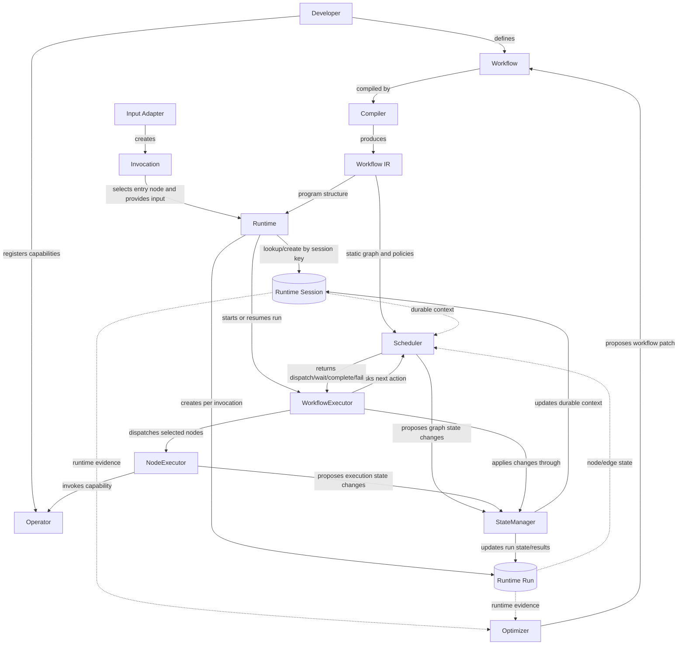

# Architecture

This document describes how the major components of AutoAgent OS fit together.
The detailed meaning of each concept is defined in Core Concepts.

## System Architecture



## Main Execution Path

Developers write Workflows. Developers may also register Operators to extend the
set of computation capabilities available to the system.

The Compiler transforms a Workflow into Workflow IR. Workflow IR is the static
program structure used by Runtime, Scheduler, and NodeExecutor.

External Input Adapters such as API handlers, Pub/Sub consumers, webhook
listeners, cron schedulers, manual triggers, or other Workflows create
Invocations. An Invocation selects one entry node and provides explicit input.
It may also provide a session key.

Runtime uses the session key to look up or create a Runtime Session. If no
session key is provided, Runtime may generate a fresh key. Runtime then creates a
Runtime Run for the invocation.

WorkflowExecutor drives the run loop. Scheduler reads Workflow IR, Runtime
Session context, and Runtime Run state to decide what should happen next.
NodeExecutor executes selected nodes and invokes Operators when needed.
StateManager applies and persists state changes from Scheduler and NodeExecutor.

## Runtime Session and Runtime Run Position

Runtime Session is the durable state container for a Workflow context. It may
store conversation history, variables, memory references, artifacts, run history,
event logs, and cross-run state.

Runtime Run is the dynamic execution state for one invocation inside a Runtime
Session. It stores node state, edge state, ready queues, running nodes, retries,
and run-local execution history.

This separation allows one-off script-like execution and long-lived contexts such
as chat conversations to use the same runtime model.

```text
without session key -> fresh Runtime Session -> one Runtime Run
with same session key -> existing Runtime Session -> new Runtime Run
```

## Input Adapter Position

Input Adapters may be long-running, but they are outside Workflow Runtime Session
and Runtime Run execution.

A Pub/Sub consumer, webhook listener, or cron scheduler should not be modeled as
a Workflow node in the first design. It should create Invocations that call into
Workflow execution through Runtime.

This keeps daemon-style infrastructure separate from one invocation's execution
through the Workflow graph.

## Operator Extension Path

Operators are reusable computation capabilities. A Workflow does not directly
implement computation. Instead, its nodes reference Operators, and NodeExecutor
invokes those Operators during execution.

This allows AutoAgent OS to treat LLMs, functions, tools, browsers, databases,
and other execution engines through the same computation model.

A node should be created when the step deserves OS-level management such as
retry, timeout, observability, failure routing, parallelism, human approval, or
external side-effect tracking. Smaller implementation details should remain
inside Operators.

## Optimization Path

Runtime Sessions and Runtime Runs produce runtime evidence over time. The
Optimizer analyzes that evidence and proposes changes to the Workflow.

The updated Workflow can then be compiled again for future execution.
