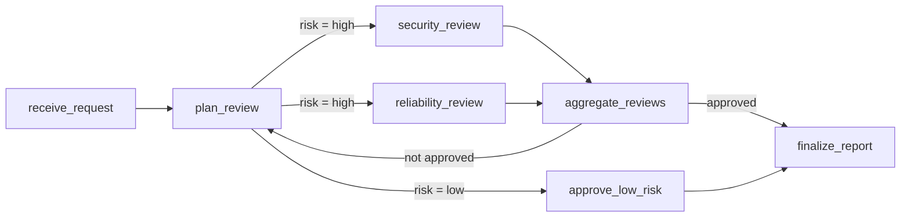
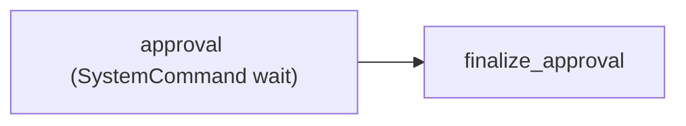
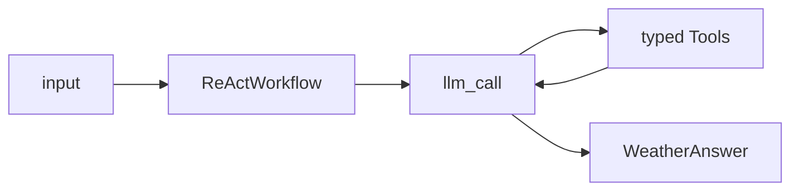

# AutoAgent Authoring Samples

This directory is one runnable AutoAgent project containing three normative
Workflow examples for Coding Agents. It demonstrates the supported authoring
style; only `auto-agent.toml` and importable Workflow entrypoints are required.
Applications may organize their remaining files differently.

## Project contract

- `auto-agent.toml` explicitly exports three Workflow objects.
- Workflow source imports authoring types only from `autoagent` and
  `autoagent.ai`.
- `pyproject.toml` declares the project dependencies.
- `inputs/` contains runnable JSON inputs.
- `expected/` contains deterministic public Invocation results.
- No Workflow creates an App, RuntimeStore, database, or Server.

Run all commands from this example project directory:

```bash
autoagent project check
autoagent workflow list
autoagent workflow preview release_review
```

Expected compilation summary:

```text
release_review     7 nodes   9 edges   1 loop
human_approval     2 nodes   1 edge    0 loops
weather_assistant 11 nodes  14 edges   1 loop
```

## 1. Conditional orchestration

User requirement: validate a release request, automatically approve low-risk
changes, and send high-risk changes through parallel Security and Reliability
reviews. Failed specialist checks cause another bounded review round. Successful
paths produce one report.



This example demonstrates:

- typed Invocation input and output;
- Condition functions;
- conditional branching;
- parallel Nodes;
- fan-in aggregation;
- a natural Loop with one external entry;
- an explicit execution limit protecting the Loop.
- a custom `release_review_completed` UserEvent mapped from the final Node.

Run it:

```bash
autoagent \
  invocation run release_review \
  --input-file inputs/orchestration.json \
  --event-mode standard \
  --trace
```

The deterministic result is `expected/orchestration.json`. The supplied
high-risk request executes two specialist Nodes in each of two rounds. Change
`risk` to `low` to exercise the automatic branch.

## 2. Durable Wait and Resume

User requirement: stop at an external approval boundary and continue from a
later CLI process with typed approval data.



Durable Resume requires a database and `standard` or `full` Event mode. Configure
one explicitly:

```bash
export AUTOAGENT_DATABASE_URL=sqlite+aiosqlite:///./authoring-runtime.db
```

Start the Invocation:

```bash
autoagent \
  invocation run human_approval \
  --session authoring-demo \
  --input-file inputs/wait-request.json
```

The command returns `STATE waiting`. A new CLI process can then resume the same
Invocation:

```bash
autoagent \
  invocation resume human_approval \
  --session authoring-demo \
  --wait-key release:42 \
  --response-file inputs/wait-response.json
```

The deterministic terminal result is `expected/wait-resume.json`.

## 3. LLM, Tools, and ReActWorkflow

User requirement: answer a weather question by calling typed city and weather
Tools, then return validated structured output. Both Tools use deterministic
mocked data.

The author writes one `react_workflow(...)`; the framework expands its internal
conversation, LLM call, Tool validation/execution, repair, and output validation
Nodes:



The project includes a deterministic Chat Completions HTTP mock. Start it in
one terminal:

```bash
uvicorn mock_chat_completions_provider:app \
  --app-dir . \
  --host 127.0.0.1 \
  --port 8899
```

Configure the built-in Provider in the terminal running AutoAgent:

```bash
export AUTOAGENT_LLM_PROVIDER=chat_completions
export AUTOAGENT_LLM_BASE_URL=http://127.0.0.1:8899/v1
export AUTOAGENT_LLM_API_KEY=mock
export AUTOAGENT_LLM_MODEL=mock-weather-model
export AUTOAGENT_LLM_STRUCTURED_OUTPUT_MODE=json_schema
```

Run the ReAct Workflow:

```bash
autoagent \
  invocation run weather_assistant \
  --input-file inputs/react-weather.json \
  --event-mode full \
  --trace
```

The input selects ReAct streaming mode. The mock first streams calls to
`get_city_profile` and `get_current_weather`, then streams the structured answer
in `expected/react-weather.json`.

ReActWorkflow installs its Agent-facing UserEvent mappings automatically:

- `llm_call` emits message, reasoning, and Tool-call deltas, followed by either
  `message_completed` or `tool_call_requested`;
- generated Tool Nodes emit `tool_result` after execution;
- `finish` emits the validated, non-streaming `agent_output`;
- Tool-call parsing and structured-output validation are internal repair steps
  and do not emit failure-specific UserEvents. The raw request remains visible
  as `tool_call_requested`, but no `tool_result` exists unless a Tool runs.

UserEvents are independent of Runtime Event mode and are process-local in this
version. The final Invocation result remains the same whether the LLM runs in
`invoke` or `stream` mode.

## Common errors

### Project manifest not found

Run the command from the example root, or pass the project directory explicitly:

```bash
autoagent project check
```

### Chat Completions configuration is missing

`project check` never needs Provider secrets. Running `weather_assistant` does.
Set the four variables shown above or configure another compatible endpoint.
Running either non-LLM Workflow does not require Provider configuration.

### Resume reports an unknown Wait key

The `--session`, `--wait-key`, database, and Workflow must match the
waiting Invocation. The sample Wait key is `release:42`.

### Resume cannot find state after restart

Memory mode cannot provide cross-process Resume. Configure
`AUTOAGENT_DATABASE_URL` before both `run` and `resume`, and do not use
`minimal` Event mode.

### Loop compilation fails

A natural Loop must have one header and one external entry. Keep the initial
`receive_request -> plan_review` edge separate from the
`aggregate_reviews -> plan_review` back edge.

## Automated verification

The packaged project tests check all three examples:

```bash
python -m unittest discover -s tests -v
```

The tests compile every exported Workflow, compare deterministic results,
exercise parallel Loop execution and a custom UserEvent, resume a Wait through
a new CLI host, run the streaming ReAct Tool loop with a fake LLM Operator, and
validate both regular and streaming HTTP mock responses.
