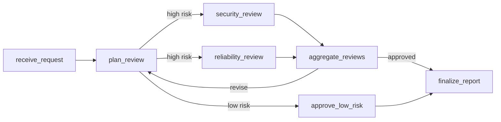
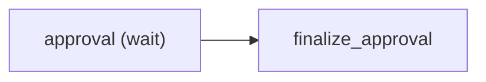

# AutoAgent Authoring Examples

This directory is one runnable project containing three deliberately different
Workflow examples and their business Evaluations. They are reference designs,
not project templates. A real project may use another module layout, fewer
models, or a much smaller graph; `auto-agent.toml` is the discovery contract.

## Read examples by behavior

Choose only the example closest to the requested business behavior:

- `workflows/orchestration.py` models a release decision that genuinely needs
  conditional routing, parallel specialist work, fan-in, and a bounded review
  Loop.
- `workflows/wait_resume.py` models one external approval boundary with only a
  Wait Node and a typed finalization Node.
- `workflows/react_assistant.py` delegates a bounded model/Tool interaction to
  `react_workflow(...)` instead of reconstructing its internal graph.

Do not reproduce a sample's Nodes, models, directories, or policies unless the
new requirement needs the same behavior. In particular, do not add a Loop,
parallel branches, Context, or a child Workflow merely because a sample uses
one.

The matching `evals/*.py` files describe business scenarios. They replace the
old pattern of separate input JSON, expected JSON, and a copied Invocation test
harness. Ordinary unit tests remain appropriate only for nontrivial isolated
project functions that need checks outside the complete Workflow.

## Example project structure

```text
authoring/
├── auto-agent.toml
├── pyproject.toml
├── .env.example
├── workflows/                 # Workflow definitions and project callables
├── evals/                     # End-to-end business Evaluation Cases
├── tests/                     # Focused tests for isolated project functions
└── mock_chat_completions_provider.py
```

This layout demonstrates separation of responsibilities, not a mandatory
folder template. A small project may use single `workflows.py` and `evals.py`
modules. Add `tests/` when project-owned helper logic deserves direct coverage;
do not recreate an App or duplicate complete Eval scenarios there.

## Project contract

- `auto-agent.toml` exports three Workflow objects and three Eval Suites.
- Workflow modules import authoring types only from `autoagent` and
  `autoagent.ai`.
- Evaluation modules import `autoagent.evaluation` and the public business
  output types they compare.
- No Workflow or Evaluation constructs an App, RuntimeStore, database, Server,
  or Provider.
- Provider credentials and runtime settings stay in the environment and CLI.

Run static checks before any Provider-dependent command:

```bash
autoagent project check
autoagent workflow list
autoagent eval list
autoagent eval check release_review
autoagent eval check human_approval
autoagent eval check weather_assistant
```

## Conditional orchestration

Requirement: validate a release request, automatically approve low-risk
changes, and send high-risk changes through independent Security and
Reliability reviews. A rejected specialist round must be revised, but the
review cannot repeat indefinitely.



The Workflow uses graph structure only where the business dependency requires
it. Named mappings reshape data; Conditions select routes; specialist Nodes do
not depend on completion order; `ResourcePolicy` provides a hard Loop bound.
The Evaluation protects both the specialist and automatic outcomes:

```bash
autoagent eval run release_review --store memory
```

## External approval

Requirement: pause a release until a later approval response arrives, then
return one typed decision.



The Evaluation performs Invoke and Resume as two Steps in one isolated Case
Session and covers approval and rejection:

```bash
autoagent eval run human_approval --store memory
```

This proves Workflow behavior in one Eval process. A production caller that
must Resume after restart additionally configures a database and uses Standard
or Full event mode; that deployment concern does not belong in Workflow source.

## LLM, Tools, and ReAct

Requirement: answer a weather question from typed city and weather Tools and
return validated structured output. The sample Tool data and model endpoint are
deterministic; they are not live weather services.

`workflows/react_assistant.py` contains only the business Tool definitions,
output model, instructions, and explicit repair/step bounds. The framework owns
the internal ReAct graph and standard UserEvents.

Start the local Chat Completions mock:

```bash
uvicorn mock_chat_completions_provider:app \
  --app-dir . \
  --host 127.0.0.1 \
  --port 8899
```

Configure the normal runtime Provider in the Evaluation terminal:

```bash
export AUTOAGENT_LLM_PROVIDER=chat_completions
export AUTOAGENT_LLM_BASE_URL=http://127.0.0.1:8899/v1
export AUTOAGENT_LLM_API_KEY=mock
export AUTOAGENT_LLM_MODEL=mock-weather-model
export AUTOAGENT_LLM_STRUCTURED_OUTPUT_MODE=json_schema
```

Then run the business Evaluation:

```bash
autoagent eval run weather_assistant --store memory
```

The Evaluation asserts only the public typed answer. It does not assert the
number or generated IDs of internal ReAct Nodes, because those are framework
implementation details rather than the business contract.

## Evaluation output

Eval Results are intended for the active Coding Agent and terminal user. They
are not written to the Runtime database. Use `--report-file` only when a normal
file is useful for handoff or later review:

```bash
autoagent eval run release_review --report-file reports/release-review.txt
```

The report is still printed to stdout. AutoAgent does not maintain a separate
Eval Result database or require historical result management.

## Focused unit tests

`tests/test_project_functions.py` demonstrates the narrow role of ordinary
tests: it checks a custom UserEvent transformation and an unsupported Tool
input without starting an App or repeating a Workflow business Case.

```bash
python -m unittest discover -s tests -v
```

Evaluation remains authoritative for end-to-end Workflow behavior. Unit tests
remain authoritative for the isolated functions they call directly.
